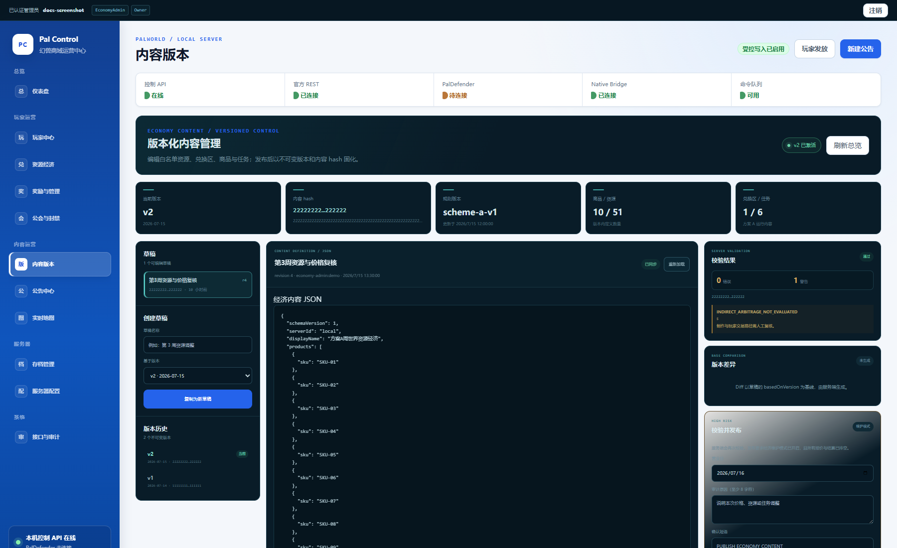
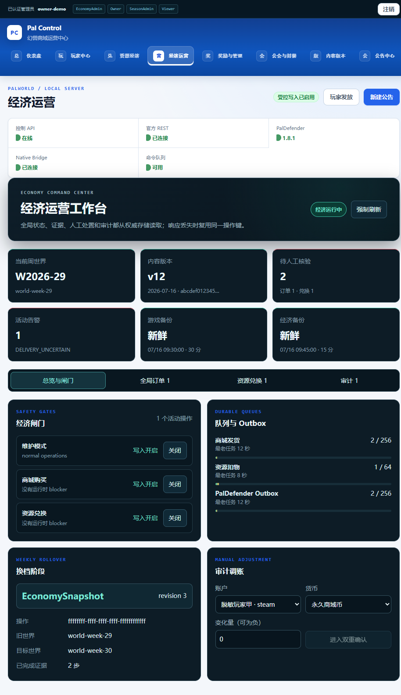
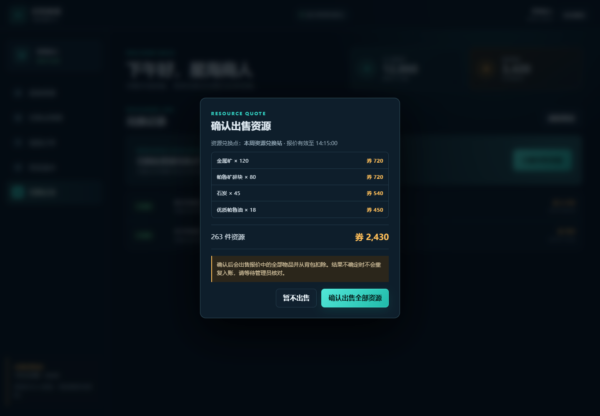
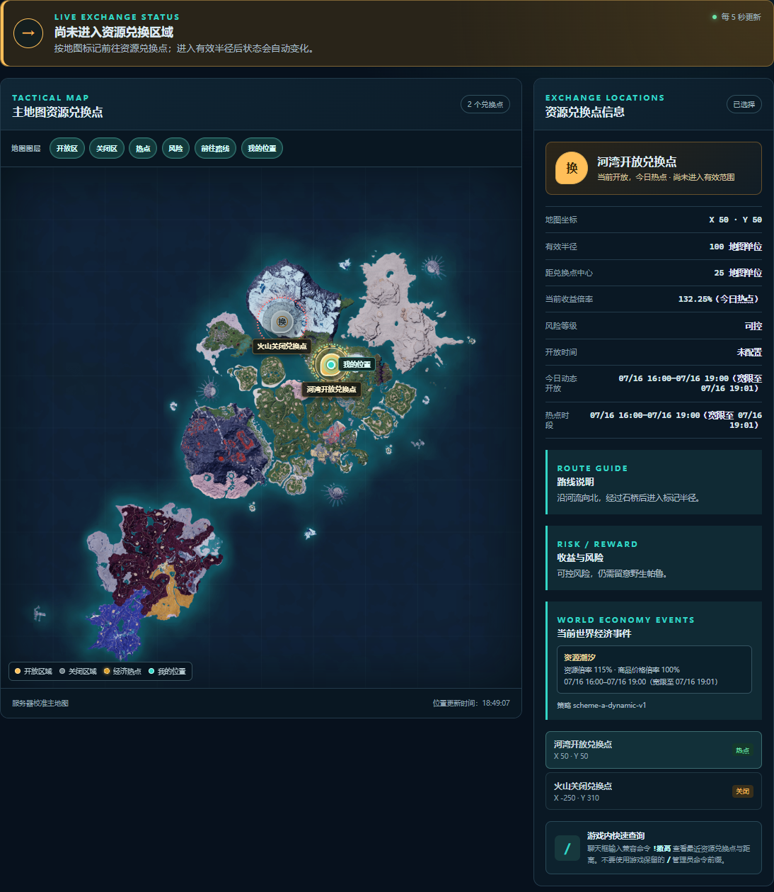
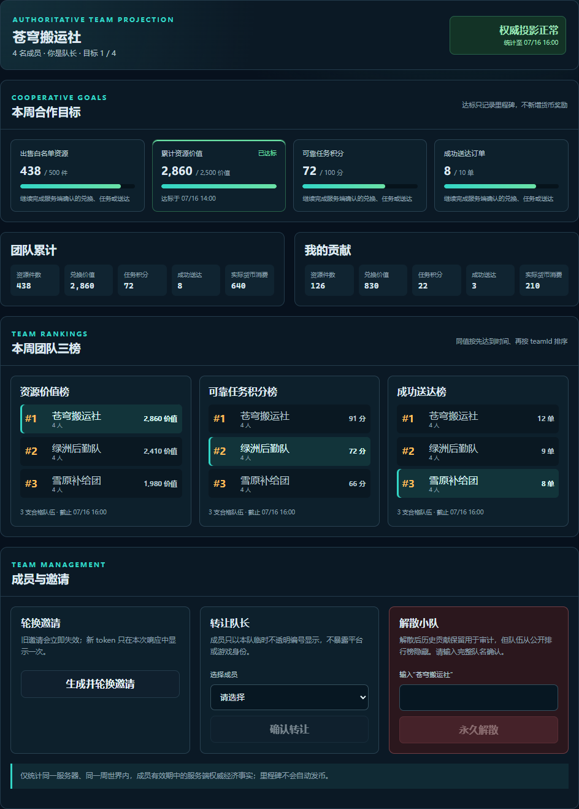
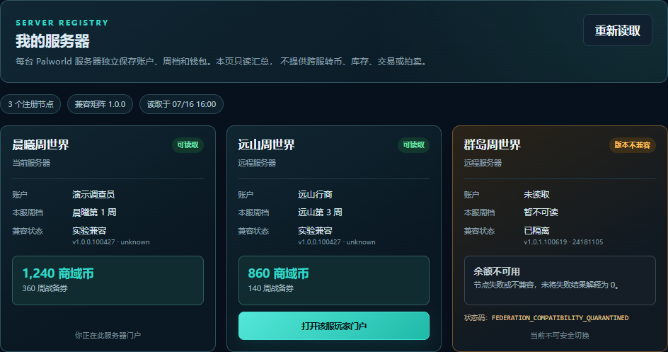
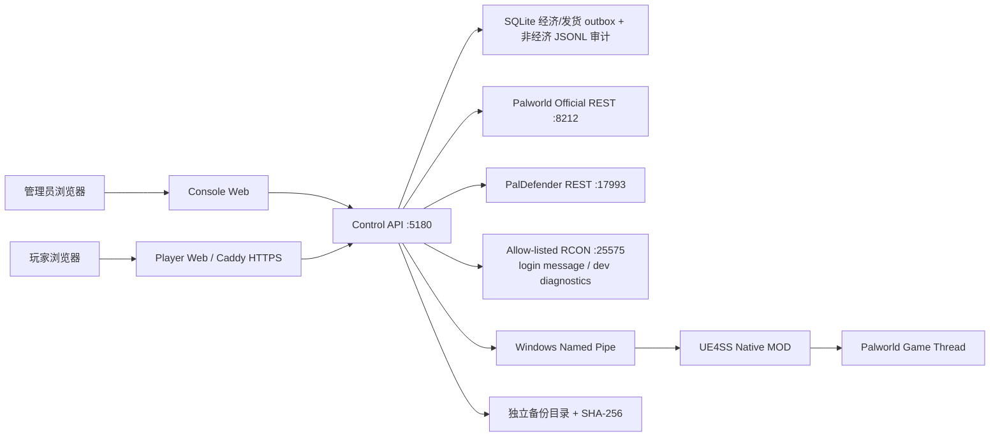

# 幻兽商域（Pal Control）

[](https://github.com/newonei/pal-control/actions/workflows/ci.yml)
[MIT License](LICENSE)

面向 Windows **Palworld Dedicated Server** 的本机优先运营控制面：包含 React 管理台、玩家自助商城、ASP.NET Core Control API、UE4SS C++ 服务端 MOD，以及“周世界资源经济服”的资源兑换与换档工具。

> 当前定位：已完成指定游戏版本上的本机开发服原型和部分真实联调，**不是可直接暴露到公网的生产系统**。管理 API、Palworld 官方 REST、PalDefender、RCON 与 Native Bridge 必须保持在服务器本机或受信网络内。

本项目是非官方社区项目，与 Pocketpair 或 Palworld 的权利方无隶属、授权或背书关系。游戏名称、商标与游戏素材归各自权利人所有。

## 项目状态

| 项目 | 当前状态 |
| --- | --- |
| 运行平台 | Windows x64；Web/API 在其他平台上的兼容性尚未验证 |
| 前端 | React 19、TypeScript 7、Vite 8 |
| 后端 | ASP.NET Core / .NET 10 |
| 本地状态 | SQLite 经济账本与 PalDefender 发货 outbox；JSONL 仅保留非经济命令/审计 side state |
| 原生 MOD | C++23、UE4SS、Windows Named Pipe |
| Native 源码候选 | Palworld `v1.0.1.100619` / Steam build `24181105`、UE4SS commit `c2ac246`、协议 `1.1`、`0.3.0-dev.39-ro` |
| 当前本机 Palworld | 与候选目标相同；dev39-ro 已由两个独立全新锁定构建复现为字节一致的 893,440 字节 DLL，SHA-256 `c2dab9f9…063b34`，但尚未实服加载或运行固定探针套件，Bridge 可用性仍是 unknown。最近的 9 项成功、3 项无人在线拒绝、0 项意外失败属于历史 dev38-ro；该版本现已 superseded/quarantined，不得当作 dev39-ro 运行证据。服务器当前已停止；仍缺在线玩家、PalDefender 组合、独立复核和任何真实写持久化 |
| 发布成熟度 | 本机开发服只读候选；仍需受控在线玩家完成三项 live probe 并由独立人员复核，再另建写候选完成原子消费保存/重启/重新登录验收；完整周换档仍是硬门槛 |
| 开源许可证 | [MIT](LICENSE) |

## 界面预览

以下截图由当前代码在本机开发环境中生成。没有连接真实在线玩家，也没有执行任何写命令；玩家名、余额、商品、兑换记录与资源报价均为浏览器内脱敏演示响应，不包含真实账号、服务器路径或密钥。公告内容同样是前端演示草稿，连接状态用于展示依赖门禁。

### 管理控制台


### 版本化内容管理

演示响应显示 10 个商品、51 个资源、2 个本地候选兑换区和 6 个任务，并展示校验警告、版本差异、不可变版本历史及高风险发布入口。



### 经济运营工作台

统一查看全局订单、资源兑换、待人工核验、持久队列、写闸门、周世界、内容版本、备份与换档阶段；证据查看、人工对账、调账等高风险操作要求授权角色、审计原因、精确确认短语与 TOTP，响应丢失后会复用原操作键恢复。



### 在线玩家地图


### 玩家门户登录


### 白名单资源选择与复核



商品与资源均使用仓库内置的有限 SVG 图标、五档稀有度和用途说明；内容定义不能引用外部图片 URL、文件路径或 HTML。旧内容未提供展示字段时由服务端返回明确的内置 fallback，不会改变旧 content hash。

### 动态兑换点地图图层

地图图层可独立显示或隐藏开放区、关闭区、经济热点、风险圈、前往路线和本人位置；关闭图层只影响本地显示，路线、开放窗口、风险、世界事件与实际收益等权威文字事实仍保留。



### 周世界团队目标与排行榜

以下页面使用脱敏演示小队、目标进度、本人贡献与团队榜数据；不包含邀请 token、账号标识或真实玩家资料。



### 多服务器只读注册（演示数据）

以下页面由真实 system Chrome 使用脱敏三节点 mock 生成，只演示账户、各服周档、双币与兼容/故障状态；不包含 federation subject、节点 key、原始 UserId 或 accountId，也不执行跨服写入。截图不是实服联调证据；当前矩阵没有任何 `stable` 组合，生产多服仍保持关闭。



<details>
<summary>查看更多界面：公告中心与接口审计</summary>

#### 公告中心


#### 接口与审计


</details>

## 功能概览

### 管理后台

- **服务器仪表盘**：集中显示 Control API、官方 REST、PalDefender、Native Bridge、命令队列、在线玩家和快捷入口。
- **玩家中心**：搜索在线玩家，查看基础资料、公会、等级、经验、背包、帕鲁和科技；Native Bridge 就绪后可使用受控的成长、背包槽位和帕鲁编辑工具。
- **奖励与玩家管理**：通过 PalDefender 发放经验、科技点、远古科技点、物品、帕鲁和帕鲁蛋，支持单项科技学习/遗忘、定向消息、踢出与封禁。
- **公会与封禁目录**：查看公会成员、基地和仓储信息，检索账号/IP 封禁记录并执行白名单内的解封操作。
- **公告中心**：创建、暂存和排期公告，按能力选择游戏聊天、顶部横幅或客户端浮层，并检查发布条件与最终回执。
- **实时地图**：从官方 REST 只读采集在线玩家位置，支持搜索、缩放、拖动、选择与持续跟随。
- **服务器配置**：搜索并分类编辑 `PalWorldSettings.ini`，提供输入校验、差异预览、危险项确认和保存前备份。
- **存档中心**：请求官方保存、复制稳定快照、生成逐文件 SHA-256 清单并复核完整性；不提供恢复、删除、上传或原始 `.sav` 编辑。
- **经济运营工作台**：从权威存储查看全局订单、资源兑换、`uncertain`、outbox、闸门、世界、版本、备份与换档阶段；支持脱敏证据、人工对账、审计调账和审计检索。高风险操作展示 before/after、授权角色与审批因子，并以服务端持久幂等键和页面恢复日志避免响应丢失后的重复执行。
- **版本化内容管理**：在维护模式下从已发布版本创建草稿，保存完整 JSON、查看语义 diff、执行严格校验，并以不可变版本和 content hash 发布或回滚；高风险切换要求 TOTP、审计原因、确认短语、幂等键和结算排空。
- **经济平衡工具**：发布前校验显式 attested 的运营经济影子 DAG，穷尽礼包拆分、至少一层转换、双币回收与费用路径，并用逐 ItemID 参考成本、类别折价目标和风险缓冲阻断发布；动态内容按“最低折扣买入 → 最高事件/限时热点倍率卖出”的跨日极值组合分析。可靠任务还必须提供 cadence/实例受限的永久商域币来源，以及至少两个正价、有限个人限购的长期消费 SKU。旧内容无 policy 时仅兼容检查并明确告警。另提供固定种子 100 玩家 × 7 业务日极值压力仿真和目标区间报告。
- **运营分析面板**：按服务器、日期口径、赛季和内容版本，从 SQLite 权威事实重算玩法入口、商城与资源兑换两条路径、商品购买率、区域热度、双币产销/余额分位数和 `uncertain`；目录分母由服务端唯一事实记录，少于 5 个账户的非零群组隐藏，页面不接收客户端埋点或返回玩家标识。详见 [指标口径与运行手册](docs/runbooks/economy-analytics.md)。
- **多服注册与兼容矩阵**：玩家“我的服务器”页面只读展示各节点账户、周档、双币与兼容状态；每个 Palworld 服务器仍由本地 Control API/SQLite 独占写面。聚合请求使用 `fed2_` caller/target/key 绑定 subject、逐 peer HMAC 请求签名、正文哈希、时间窗和 nonce 防重放；身份与签名 key 均可按版本轮换，单 key 或整 peer 可独立吊销。节点失败或版本漂移会显式显示 unavailable/incompatible，不会冒充 0 余额；切服只打开配置 allowlist 中的门户 URL，不附加身份或 session，也不支持跨服转币、库存或交易。版本化矩阵用 canonical SHA-256、精确 game/Steam build/PalDefender/UE4SS/Native 组合和证据 fail-closed；dev36 仅为 experimental，dev37-ro 因离线库存缺陷隔离，dev38-ro 只保留历史受控运行证据。当前 dev39-ro 只有可复现制品证据、Bridge 可用性 unknown，仍因实服固定套件、在线玩家三项、PalDefender 组合和独立复核缺失而保持 quarantined。详见 [多服务器与兼容矩阵手册](docs/runbooks/server-federation-and-compatibility.md)。
- **接口与审计**：展示 PalDefender 白名单能力、运维命令和追加式审计记录；需要异步游戏副作用的命令使用持久化队列与最终回执。

### 玩家门户

- **Steam + 本周角色双层登录**：公网 Steam 服先经官方 OpenID 证明平台身份，再由在线角色接收 8 位游戏内验证码绑定当前 `worldId + PlayerUID`；可信好友服才可显式使用仅验证码 fallback，网页不收集 Steam 或游戏密码。
- **双币钱包与战备商城**：查看永久商域币、周战备券、显式商品分类/标签/推荐位、仓库内置 SVG 图标、五档稀有度、用途、个人周限购与可选全服库存，在线购买并跟踪发货状态；旧内容版本的 offer 会被稳定拒绝。
- **新玩家活动**：服务端支持按周世界发布不可变活动版本；玩家显式领取后，双钱包奖励、两条账本和领取记录在同一事务提交，同一版本只能领取一次。
- **可靠任务与新手引导**：首页提供 5 步真实状态引导；日/周任务只累计服务端可复核的兑换、指定资源/价值、成功订单和货币消费事件，事件与奖励均可幂等重放。
- **同服周世界团队协作**：玩家可创建小队或用一次显示、受次数限制的 HMAC 邀请加入；四项目标、团队/本人贡献和资源价值/任务积分/成功送达三榜只重放成员有效期内的服务端权威经济终态。公开榜不展示成员身份，排除账户不计入门槛或贡献，达标不自动发币。详见 [团队经济运行手册](docs/runbooks/team-economy.md)。
- **订单与资金流水**：只允许玩家查询自己的订单、退款/不确定状态以及购买、活动和资源兑换形成的账本记录。
- **个人兑换点地图**：只返回当前登录玩家的位置，以及当日确定性开放/关闭区、显式风险等级、限时热点、纯经济世界事件、窗口/下一开放时间、距离、路线和权威收益倍率；开放区、关闭区、热点、风险圈、路线和本人位置可独立切换，不暴露其他玩家坐标。
- **资源报价与兑换**：扫描允许容器中的白名单资源，按当前动态区/热点/事件生成带完整版本和 seed/window/multiplier 证据的限时报价；每行显示本地 SVG 图标、稀有度和用途，默认全选，玩家可取消勾选或调低数量并复核，未选资源不会进入扣物授权清单。源报价取消与所选子报价插入在同一 SQLite 行级写批次中提交，确认扣物后唯一入账；处理中订单/兑换使用页面可见时的 3 秒有界轮询，终态后停止。
- **周档结算**：自动读取最近冻结周榜，展示本人资源/任务成绩与名次、参与或排除原因、规则与截止时间、周券过期数量，以及每项永久商域币奖励的待发/取消/账本已发状态；不要求玩家提供 UUID，也不返回其他账户。
- **本人消息中心**：订单送达、资源结算、周档冻结/奖励/周券过期和异常对账均由权威状态生成持久通知；浏览器系统提醒只在玩家主动授权后启用，拒绝或不支持时仍保留站内 feed。游戏内投递默认关闭，升级回填的历史 feed 不会在之后启用时批量补发；能力不支持定向 `players + player-message` 时明确显示 `blocked`，不会伪装已经送达。

### 服务端与安全

- **统一 Control API 边界**：浏览器只连接 ASP.NET Core API；官方 REST、PalDefender REST、白名单 RCON 与 Native Bridge 均由服务端封装。
- **幂等队列与最终状态**：公告、通知、存档和 PalDefender 写操作使用 `Idempotency-Key`、持久队列与追加式审计；派发后无法证明结果时进入 `uncertain`，禁止盲目重发。
- **事务经济账本**：SQLite 保存账户、钱包、订单、账本和资源兑换事件，明确失败可退款，不确定结果转人工对账。
- **玩家门户防护**：显式 Origin 白名单、HttpOnly/Secure/SameSite Cookie、CSRF Token、验证码限流、请求限流和并发上限。
- **管理员认证与 RBAC**：管理 API 使用独立 API Key（仅保存 SHA-256）、`Viewer`/`Operator`/`EconomyAdmin`/`SeasonAdmin`/`Owner` 五级角色；调账、人工对账和换档写入还要求 TOTP 与审计原因。玩家 Cookie 不能访问管理路由。
- **统一 Economy Safety Gate**：购买、资源兑换和后台发货共享存储、周世界、玩家绑定、版本/能力、维护与队列容量检查；购买和资源兑换可独立熔断并在线恢复，运行时漂移只关闭对应写路径。详见 [运行手册](docs/runbooks/economy-safety-gate.md)。
- **最小公网暴露**：公网反向代理只能开放玩家门户静态页面和 `/api/v1/player/*`；管理 API、官方 REST、PalDefender、RCON 与 Named Pipe 不应公开。

### UE4SS Native 集成

- **运行时绑定的本机 Named Pipe**：协议 1.1 使用长度前缀 JSON、hello/heartbeat、受限命令队列和游戏线程命令泵；注册任何 Unreal hook 前先核对宿主 PalServer EXE 与 UE4SS runtime 大小/SHA-256，hello 再上报 Steam build、实际 EXE/Native/UE4SS 身份和 write mode。Control API 还会从 pipe 句柄取得服务端 PID，以低权限查询独立解析并哈希该进程的主 EXE；模块摘要由已绑定宿主的 Native 从实际加载路径读取，并继续与锁和批准配置比较。
- **当前只读候选**：dev39-ro 源码只声明玩家、成长、背包、帕鲁和通知签名探针；CMake/构建脚本、hello capability、Control API transport 和游戏线程 adapter 四层共同禁止写入。库存只有在当前权威世界的有效玩家控制器引用对应 PlayerState 时才标记 `ownerOnline=true`，Control API 对缺失或 false 均 fail-closed。当前仅完成双独立可复现构建，尚未证明实服 Bridge 或任何运行探针；历史写实现仍保留在源码中，但只读实服门禁通过前不可启用或部署。
- **原生通知**：在签名与版本门禁通过后发布顶部横幅、客户端浮层和定向 UI 通知。
- **玩法扩展源码**：保留 `!撤离`/`!extract` 本人资源兑换点查询和实验性随机安全复活实现；dev39-ro 不安装这两个 hook，后续必须经过独立写能力评审才可重新启用。

### 功能启用条件

| 能力 | 最低依赖 |
| --- | --- |
| 管理台外壳、健康检查、命令队列 | Control API |
| 玩家列表、服务器状态、实时地图 | Palworld 官方 REST |
| 奖励、公会、封禁和 PalDefender 运维 | PalDefender REST 与受限 Token |
| 背包/帕鲁精细工具、顶部横幅、客户端浮层 | 精确版本 UE4SS Native MOD |
| 玩家登录与本周角色绑定 | Player Portal、PalDefender REST 提供的在线 PlayerUID、经授权的本机白名单资源目录，以及本机受限 RCON `/send` 验证码通道；公网服还需 Steam OpenID/HTTPS |
| 商城发货 | Player Portal、PalDefender 结构化发货回执与 Economy Safety Gate |
| 商城/兑换初始化 | 在启用 `ExtractionMode` 前，管理员先生成经授权的资源目录快照并放在 `services/control-api/Resources/palworld-resource-catalog.json`；公开发行物不含该外部数据快照 |
| 资源兑换 | Player Portal、PalDefender 在线角色定位、精确版本 Native MOD、稳定 `inventory.consume` 持久化能力与周世界门禁 |
| 团队目标与排行榜 | 已启用的 Player Portal/ExtractionMode、已绑定周世界、SQLite 权威经济事实，以及外部注入的独立 `TeamEconomy__InvitePepper` |
| 玩家消息游戏内投递 | 先以默认 `PlayerNotifications:GameDeliveryEnabled=false` 完成站内 feed 回填；确认定向 `players + player-message` Native 能力与审计后再显式启用 |
| 多服务器只读注册 | `Federation.Enabled=true`、全节点一致且版本化的 `IdentityKeys`/矩阵、逐 peer 可吊销签名密钥、caller/target/subject v2 绑定、逐节点 TLS，以及每个节点已审核的 `stable` 组合；当前无 stable 组合，生产保持关闭 |

默认配置中 **PalDefender、RCON、玩家门户、TeamEconomy、Federation 和玩家消息游戏内投递全部关闭**；Windows 安装器与生产样例还会把 `ExtractionMode` 关闭、初始双币设为 0。此时没有本地资源目录也能启动基础 Web/API。启用 `ExtractionMode` 后，Control API 会在接受 HTTP 流量前校验目录并原子初始化首个内容版本；目录缺失或非法会让启动失败，不会伪装成“已启用但没有内容”。TeamEconomy 还要求通过环境变量或受保护外部配置提供独立的 32–512 字符 `TeamEconomy__InvitePepper`，不要把真实值提交到仓库。完整运营能力仍需要按本文配置外部服务，界面会依据服务端 capabilities 禁用未满足条件的写操作。

## 架构



除玩家门户的静态页面和经过严格白名单的 `/api/v1/player/*` 外，图中的服务端接口都不应直接暴露到互联网。

## 目录结构

```text
pal-control/
├─ apps/
│  ├─ console-web/              # 管理控制台
│  └─ player-web/               # 玩家自助商城
├─ services/control-api/        # ASP.NET Core Control API
├─ mods/pal-control-native/     # UE4SS C++ 服务端 MOD 源码
├─ packages/contracts/          # OpenAPI 与 Native Bridge 契约
├─ extraction-mode/             # 玩法设计、换档与检查脚本
├─ deploy/
│  ├─ windows/                  # Windows 配置示例和运维脚本
│  └─ player-portal/            # Caddy 玩家门户模板
├─ docs/                        # 架构、安全与运行手册
├─ tests/                       # 隔离式集成 smoke tests
└─ tools/                       # Bridge smoke 与资源目录工具
```

## 环境要求

基础 Web/API 开发环境：

- Windows 10/11 或 Windows Server x64；
- Node.js `22.12+`；
- npm `11+`；
- .NET SDK `10.0`；
- PowerShell 7 推荐，Windows PowerShell 5.1 未做完整验证；
- Python 3（只在部分隔离式集成测试中使用）。

连接真实游戏服还需要：

- 单独安装的 Palworld Dedicated Server；
- 已启用且只允许本机访问的官方 REST API；
- PalDefender（奖励、公会、封禁、商城发货、玩家登录与资源兑换所需；只使用基础 REST/地图时可不安装）；
- Native 功能所需的精确版本 UE4SS 和重新编译的 MOD。

开发者若要从源码同时生成便携 ZIP 与 Windows 安装程序，还需安装 Inno Setup 6；只构建 Web/API 或使用已发布安装包时不需要。

仓库**不包含** SteamCMD、PalServer、UE4SS 运行时、PalDefender 二进制、真实存档或任何游戏服务端文件。

## 快速开始

### 普通用户：使用 Windows 安装包

从 [GitHub Releases](https://github.com/newonei/pal-control/releases) 下载的 `幻兽商域-Setup-*.exe` 是 Windows x64 安装程序，自带 .NET 运行时和已经构建好的网页，不需要安装 Node.js、npm 或 .NET SDK。若 Releases 尚未提供安装程序，请按下方“从源代码运行”构建，不要从第三方网盘下载安装包。

1. 双击安装程序并按提示完成安装。
2. 从开始菜单打开“配置幻兽商域”，选择现有的 Palworld Dedicated Server 目录并填写服务器管理员密码。
3. 打开“启动幻兽商域”，程序会在本机启动并自动打开管理台。
4. 需要退出时打开“停止幻兽商域”。

完整分步说明见 [普通用户安装与使用教程](docs/安装使用说明.html)。玩家门户、PalDefender、RCON 和 Native MOD 属于进阶功能，默认保持关闭；确认版本和安全边界后再逐项启用。

公开安装包不包含外部游戏数据目录，也不内置目录生成脚本。要启用方案 A，请从本仓库取得并审查 `tools/catalogs/update-palworld-resource-catalog.ps1` 及其外部数据条款，然后在仓库根目录生成到安装位置，例如：

```powershell
.\tools\catalogs\update-palworld-resource-catalog.ps1 `
  -OutputPath "$env:LOCALAPPDATA\Programs\PalControl\Resources\palworld-resource-catalog.json"
```

也可以在同一路径放入自行取得授权且符合 schema 的目录快照。生成文件仅留在服务器本机，不要提交或重新分发。

开发者可运行 `deploy/windows/build-release.ps1` 重新生成便携 ZIP 和安装程序。

### 开发者：从源代码运行

以下命令均从仓库根目录 `pal-control` 执行。

### 0. 获取源码

```powershell
git clone https://github.com/newonei/pal-control.git
Set-Location .\pal-control
```

### 1. 安装依赖

```powershell
npm ci
dotnet restore .\services\control-api\PalControl.ControlApi.csproj
dotnet restore .\tools\bridge-smoke\PalControl.BridgeSmoke.csproj
```

### 2. 创建本地配置

复制不含凭据的示例文件：

```powershell
Copy-Item `
  .\deploy\windows\appsettings.Local.example.json `
  .\services\control-api\appsettings.Local.json
```

编辑 `services/control-api/appsettings.Local.json`，至少确认：

- `Palworld:InstallRoot` 指向本机 `PalServer`；
- `Palworld:OfficialRestApi:BaseUrl` 与服务端 REST 端口一致；
- `Palworld:OfficialRestApi:Password` 与服务端管理员密码一致；
- 未使用的 PalDefender、RCON、Player Portal 保持 `Enabled: false`；
- `ExtractionMode:Enabled` 首次保持 `false`；完成身份、发货回执、Native 稳定能力、备份和 Safety Gate 检查后再显式打开。

生成管理员 API Key、TOTP 密钥与可复制的 principal 配置（凭据只显示一次）：

```powershell
.\deploy\windows\new-admin-credential.ps1 -Subject local-owner -Roles Owner
```

把命令输出的 principal 写入 `Security:AdminAuthentication:Principals`。仅限明确的本机开发配置可以启用 `EnableLoopbackDevelopmentPrincipal`；生产样例强制关闭它。API 只保存 API Key 的 SHA-256，原始 API Key 与 TOTP 密钥应放进密码管理器，不能提交到 Git。

`appsettings.Local.json` 已被 `.gitignore` 排除。不要把密码、Token、Cookie 密钥或公网域名写进 `appsettings.json` 和任何 `*.example.*` 文件。

正式服不要把 REST 密码填入可公开模板；可在受限的服务账户环境中使用 ASP.NET Core 配置变量 `Palworld__OfficialRestApi__Password`。Windows 安装器会将本机 `appsettings.Local.json` ACL 限制为当前账户与 SYSTEM；该文件仍只能留在服务器本机。

只验证 Web/API 外壳时可以不启动 PalServer；依赖真实游戏数据的页面会显示离线或降级状态。

开源仓库刻意不包含 `services/control-api/Resources/palworld-resource-catalog.json`，因为外部数据再分发授权尚未闭环。准备启用方案 A 前，先确认 Paldeck、PalCalc、BWIKI 和底层游戏数据条款允许当前用途，再在仓库根目录运行以下命令，或把经授权的替代快照放在同一精确路径：

```powershell
.\tools\catalogs\update-palworld-resource-catalog.ps1
```

随后再把 `ExtractionMode:Enabled` 改为 `true` 并启动 Control API。启动初始化器会在 HTTP 流量进入前校验目录、按真实存在的 ItemID 生成并原子激活首个内容版本；目录缺失或非法会直接启动失败。只验证基础管理台时可以保持 `ExtractionMode:Enabled=false`。不要使用 `git add -f` 上传本机生成目录。

### 3. 启动 Control API

终端一：

```powershell
dotnet run --project .\services\control-api\PalControl.ControlApi.csproj
```

检查进程存活：

```powershell
Invoke-WebRequest http://127.0.0.1:5180/health/live |
  Select-Object -ExpandProperty Content
```

### 4. 启动管理台

终端二：

```powershell
npm run dev:web
```

打开 `http://127.0.0.1:5173`。

### 5. 可选：启动玩家门户

终端三：

```powershell
npm run dev:player
```

打开 `http://127.0.0.1:5175`。默认只能看到登录入口；完整登录需要启用 `PlayerPortal`、PalDefender 与游戏内一次性验证码通道，并满足已批准的游戏/PalDefender 版本门禁。验证码由本机受限 RCON `/send` 能力私发给当前在线角色；RCON 不参与正式资源扣物，资源兑换只接受经真实持久化验收的 Native 稳定能力。

### 默认地址

| 服务 | 地址 | 是否允许公网直连 |
| --- | --- | --- |
| 安装包管理台 / Control API | `http://127.0.0.1:5180/` | 否 |
| 安装包玩家页 | `http://127.0.0.1:5180/player/` | 否 |
| 源码管理台 Vite 开发服务器 | `http://127.0.0.1:5173` | 否 |
| 源码玩家门户 Vite 开发服务器 | `http://127.0.0.1:5175` | 否 |
| Palworld 官方 REST | `http://127.0.0.1:8212` | 否 |
| PalDefender REST | `http://127.0.0.1:17993` | 否 |
| 本机 RCON | `127.0.0.1:25575` | 否，禁止端口映射 |

## 使用教程

### 连接 Palworld 服务端

1. 先备份现有世界存档。
2. 在 `PalWorldSettings.ini` 中设置强随机 `AdminPassword`，并启用官方 REST：`RESTAPIEnabled=True`、`RESTAPIPort=8212`。
3. 不要在路由器、云安全组或内网穿透中开放 `8212`、`17993`、`25575`、`5180`。
4. 在私密的 `appsettings.Local.json` 中填写安装目录、REST 地址与密码。
5. 启动 API 后，先确认管理台的服务器信息、在线玩家和 metrics 等只读能力，再逐项启用写能力。

首次服务端启动和 MOD 门禁详见 [首次启动运行手册](docs/runbooks/first-server-start.md)。该文档中的示例路径仅供参考，请替换为自己的安装路径。

### 使用管理台

1. 打开管理台并检查仪表盘依赖状态。
2. 在“玩家中心”中选择在线玩家，读取成长、背包、帕鲁和科技信息。
3. 发放物品、经验、科技或帕鲁前，确认目标玩家、内部资源 ID、数量和审计原因。
4. 公告与通知会分别使用官方 REST 或 Native Bridge；结果为 `uncertain` 时先人工对账，不要重复点击发送。
5. 存档中心只负责保存、复制和校验。任何恢复或替换操作都应停服后按独立维护流程执行。

PalDefender 的安装、Token 文件、版本和权限边界见 [PalDefender 集成运行手册](docs/runbooks/paldefender-integration.md)。

经济内容不要直接改运行数据库或旧的 `SeedProducts` 兼容路径。草稿、diff、严格校验、维护排空、发布、失败重放与回滚步骤见 [经济内容发布与回滚运行手册](docs/runbooks/economy-content-publishing.md)。

### 使用玩家商城

本地联调时，在 `appsettings.Local.json` 中启用玩家门户，显式使用 `AuthenticationMode: "TrustedGameCode"`，将 `CookieSecure` 临时设为 `false`，并只加入开发地址 `http://127.0.0.1:5175`。这只是可信好友服 fallback，不是 Steam 网站身份验证。公网 Steam 部署必须使用 `AuthenticationMode: "OpenIdThenGameCode"`、`PublicSteam: true`、安全 Cookie、官方 `https://steamcommunity.com/openid/` 和固定 HTTPS realm/return_to；Production 启动校验会拒绝降级配置。完整示例见 [玩家门户部署与安全资料](docs/player-portal/README.md)。

玩家登录流程：

1. 公网 Steam 服先跳转到 Steam 官方 OpenID 页面；本站不接收 Steam 密码；
2. OpenID 成功只建立短时“待绑定 Steam 身份”，尚不能访问钱包或交易；
3. 角色保持在线，在游戏内接收 8 位一次性验证码；
4. 验证码成功且服务端实时确认当前周 `worldId + PlayerUID` 后，才建立正式会话；
5. 登录后查看钱包、商品、订单、流水、本人资源兑换点地图、最近冻结的周档结算和消息中心。需要系统级浏览器提醒时，在消息中心主动点击授权；拒绝权限不影响站内消息。可信好友服会从第 3 步开始，并明确显示 fallback 提示。

不要让玩家输入游戏密码，也不要让其把验证码发给他人。

完整的活动领取、可靠任务、购买、兑换、周档结算、异常终态和 5 步引导说明见 [玩家使用教程](docs/player-portal/05-玩家使用教程.md)。

### 使用周世界资源经济模式

当前闭环允许出售本周世界允许容器中的任意白名单资源：内置方案 A 内容列出 10 个商品候选和 51 个可售资源候选。启用 `ExtractionMode` 后，Control API 在启动阶段按本机授权资源目录中真实存在的 ItemID 生成并原子激活首个内容版本，完成后才接受 HTTP 流量。内容版本冻结商品、个人/全服库存、兑换区、任务、营业日、规则版本、hash，以及显式 attested 的运营经济影子 DAG。默认双点池每天确定性开放 1 点并声明风险等级，第 8–11 小时为限时热点；每天还确定性选择“资源繁荣”（回收收益 +15%）或“战备补给”（日价再乘 90%，最低有效价为基础价 81%）纯经济事件。目录、地图、报价和 run 固定同一 eventId/seed/window/multiplier 证据；事件不伪造击杀、掉落或采集。影子图按最低买价与最高事件/热点卖价穷尽跨日套利路径，并校验逐 ItemID 参考成本与类别风险缓冲；它明确不是实际 Palworld 配方数据库，也不覆盖玩家私下交易。新报价只在开放窗口内生成，不能跨事件/热点开始边界继续使用旧倍率；活动报价仅在其 `graceSeconds` 和报价自身有效期内完成，所有点关闭则返回下一开放时间。内容 A 的报价即使仍在 grace 内也不能跨 current pointer B 结算。确认后由通过稳定门禁的 Native `inventory.consume` 扣物，再在同一 SQLite 事务中唯一增加周战备券；生产路径不再使用 RCON 模拟扣物。候选点 2 明确标注“待实服校准”，因此第二个真实兑换区验收、连续两个真实周档报告和真实多人周档仍未完成。当前 dev39-ro 仅完成 893,440 字节、SHA-256 `c2dab9f9bfd3c47ac1a244139fb96ce1de6f598c4bce438ebddde96185063b34` 的双独立可复现构建，尚未实服加载或运行固定探针套件，也不发布任何 consume/write capability。9 项非玩家成功、3 项无人在线拒绝、0 项意外失败是已 superseded/quarantined 的 dev38-ro 历史证据，不可转记给 dev39-ro；dev36 experimental 与存在 offline-inventory 边界缺陷的 dev37-ro 同样仅作历史记录。写闸门会保持关闭，直到 dev39-ro 先完成受控实服固定套件，再由受控在线玩家完成剩余只读探针、固定 PalDefender 组合、独立复核通过、另行评审写候选，并由固定版本真实玩家完成“扣物 → 保存 → 停服 → 重启 → 重新登录”持久化验收；官方保存与优雅关服本身只证明维护流程。在此之前仅适合受控开发服。完整产品规则见 [ADR-0001](docs/architecture/decisions/0001-weekly-world-resource-economy.md)。

选择出售时，浏览器只提交源报价 `revision` 与选中的 `ItemID/quantity`，玩家身份、账户和赛季只取 HttpOnly 会话。服务端原子取消源报价并创建冻结同一内容/动态事件证据的子报价；同一 `Idempotency-Key` 在响应丢失或进程重启后返回同一个子报价，同键换账户、源报价或选择内容会冲突且无副作用。Native 子报价保留完整背包快照/hash 用于乐观锁，但消费授权只包含所选行；Development RCON 诊断同样只发送所选行。详细契约、恢复与值班检查见 [选择性资源出售运行手册](docs/runbooks/selective-resource-sale.md)。

只读检查和周换档入口：

```powershell
$adminKey = Read-Host "Control API 管理密钥" -AsSecureString
.\extraction-mode\scripts\Test-ExtractionMode.ps1 -AdminApiKey $adminKey
.\extraction-mode\scripts\Invoke-WeeklyRollover.ps1 -PlanOnly -AdminApiKey $adminKey
```

也可以使用 `-AdminApiKeyFile C:\ProgramData\PalControl\secrets\admin-api-key.txt`；脚本会拒绝重解析点以及向 Everyone、Authenticated Users 或 Users 开放读取的文件。不要把密钥写进命令行、仓库或截图。

正式换档前请完整阅读 [幻兽商域模式说明](extraction-mode/README.md)，不要跳过交易关闸、备份验证和未决交易对账。

### Native MOD

Native MOD 与 Palworld/UE4SS 的精确 ABI 绑定。游戏或 UE4SS 更新后必须重新构建，并在只读模式完成探针验证；不匹配时应保持 fail-closed。

源码、目标版本和部署结构见 [Native MOD 文档](mods/pal-control-native/README.md)，依赖锁定见 [`dependencies.lock.json`](mods/pal-control-native/dependencies.lock.json)。先对完全干净的锁定 checkout 运行 `Prepare-Ue4ssSource.ps1`，它只应用受审的 MOD 附件、Cargo.lock、Cargo `LOCKED` 与完整依赖提交补丁；再由 `Build-PalControlNative.ps1` 核对 UE4SS/全部子模块、精确补丁、CMake/Rust/MSVC、独立构建目录及最终 DLL 大小/SHA-256。两者都不会部署或重启服务；本地 `third_party/`、构建树和二进制不会作为源码发布物提交。

## 构建

```powershell
npm run build:web
npm run build:player
dotnet publish .\services\control-api\PalControl.ControlApi.csproj `
  -c Release `
  -o .\artifacts\control-api
```

`dist/`、`bin/`、`obj/` 和 `artifacts/` 都是可再生成产物，不应提交到 Git。

### 生产单实例部署

当前生产入口只支持 Windows x64 单机：Control API 与进程内 workers 使用一个最小权限 Windows Service，Caddy 使用另一个服务，SQLite 和 Caddy TLS 数据全部放在版本目录之外。发布物包含 commit、dirty 状态、数据契约和逐文件 SHA-256；安装/升级要求显式批准 ZIP hash，升级失败会在公网边界关闭期间恢复停服冷快照、旧程序和旧静态根。同一数据契约的主动回滚保留当前账本；跨契约降级会被拒绝。只读迁移审计器可在停写副本上逐账户重算余额并严格比较 ledger、订单、run、delivery、幂等证据和全部 SQLite 应用表逐行 canonical hash。

完整的目录准备、首次安装、升级前排空、可重复升级、回滚、密钥轮换和故障处置见 [单实例生产部署、升级与恢复手册](docs/runbooks/production-deployment-and-recovery.md)，数据核对命令见 [SQLite 经济迁移前后核对手册](docs/runbooks/economy-migration-reconciliation.md)。当前方案 A 的单服 5–10 人目标按 [ADR-0003](docs/architecture/decisions/0003-sqlite-capacity-and-postgresql-triggers.md) 继续使用单实例 SQLite；容量、24 小时 soak、真实写锁/积压、RPO/RTO 或 HA 要求越线时必须重新立项。仓库尚未宣称 Docker、PostgreSQL、多实例/HA、真实空白机验收或 24 小时 soak 已完成。

## 测试

统一测试入口当前运行 15 个 contract 与 37 个 integration 脚本（共 52 个），并包含管理台 21 项、玩家端 32 项单元测试和 15 个 Playwright 玩家门户 E2E。默认与 CI 使用 Playwright Chromium；设置 `PLAYWRIGHT_USE_SYSTEM_CHROME=1` 可额外复核系统 Chrome，本发布候选也已完成 system Chrome 15/15。测试覆盖方案 A 契约、Steam OpenID、玩家经济安全、选择性资源出售、物品展示/地图图层、团队经济、多服只读聚合、Windows 配置保留、管理员操作幂等键、结算状态机、SQLite outbox、连续性、版本化内容、内容投影原子性、可靠任务、通知重放/崩溃恢复、永久币来源/消费上限、120 账户权威运营分析、周报归档、受控恢复、区域校准、验收证据、短时非验收 soak、生产部署/恢复、SQLite 迁移一致性核对、日志关联/脱敏审计和经济不变量 harness。浏览器用例覆盖 375×812 手机布局、纯键盘与弹窗焦点、六个地图图层、关闭区/位置轮询失败时撤销出售资格、展示 fallback、选择性出售响应丢失、团队目标/邀请/榜单、三节点故障隔离、周档结算、本人消息中心、显式浏览器通知授权、错误播报语义，以及相关页面的 Axe WCAG A/AA 严重和致命规则。它们使用本地 fake、合成资源目录与临时目录，不会连接真实 Palworld 服务端，也不依赖本机被忽略的授权目录；短时 CI soak 也不能替代正式 24 小时运行：

```powershell
npx playwright install chromium # 首次运行或浏览器缓存缺失时
npm run build
npm test
```

Windows GitHub Actions 会执行 Gitleaks、`npm ci`、两个前端构建、Control API/Bridge smoke/.NET 测试 harness 的 Release 构建和统一测试。结算 harness 已覆盖旧数据兼容、lease/CAS、终态不可倒退、SQLite 原子入账、队列背压、1000 并发唯一 credit 和崩溃恢复；发货 harness 覆盖 SQLite PalDefender outbox 的 100 路并发、server+key 唯一、租约恢复、dead-letter、事件不可变、终态不可重开、`dispatched` 不重发及旧 JSONL fail-closed 迁移。Steam/玩家经济黑盒覆盖 state/nonce、Origin、CSRF、IDOR、账号/世界绑定、商城、发货，以及仅用于隔离测试的 development-RCON 扣物兼容路径、唯一入账和退出；独立的 Native settlement harness 覆盖 Native 报价快照、精确扣物证据、持久化故障和重启幂等。能力测试还验证购买与资源兑换闸门独立关闭。上述自动测试不替代正式域名 Steam 回调、真实 Palworld/Native 保存重启、重新登录及完整周档演练。

## 数据与安全边界

- `services/control-api/data/`：SQLite、命令队列、审计和锁文件，只属于当前运行实例；
- `services/control-api/Resources/palworld-resource-catalog.json`：外部数据生成快照，授权未闭环前只留本机；
- `backups/`：真实存档备份，可能包含玩家标识和服务器状态；
- `appsettings.Local.json`、`.env*`：密码与 Token；
- `PalServer/`、`steamcmd/`、`Saved/`：游戏运行时、Steam 元数据、真实世界和玩家存档；
- `artifacts/`、`output/`、`bin/`、`obj/`、`dist/`、`third_party/`：构建、测试或下载产物。

以上内容均不得提交。完整的上传/排除矩阵、许可证风险和 GitHub 发布步骤见 [开源发布方案](docs/open-source-release.md)。

## 文档索引

- [总体架构](docs/architecture/overview.md)
- [ADR-0001：采用周世界资源经济服](docs/architecture/decisions/0001-weekly-world-resource-economy.md)
- [ADR-0002：Steam OpenID 与当前周角色绑定](docs/architecture/decisions/0002-steam-openid-and-world-binding.md)
- [ADR-0003：SQLite 容量结论与 PostgreSQL 重新立项条件](docs/architecture/decisions/0003-sqlite-capacity-and-postgresql-triggers.md)
- [MOD 能力与接口维护手册](docs/MOD能力与接口维护手册.md)
- [玩家门户部署与安全资料](docs/player-portal/README.md)
- [玩家使用教程](docs/player-portal/05-玩家使用教程.md)
- [PalDefender 集成运行手册](docs/runbooks/paldefender-integration.md)
- [经济内容发布与回滚运行手册](docs/runbooks/economy-content-publishing.md)
- [经济运营工作台与响应丢失恢复](docs/runbooks/economy-operations-workbench.md)
- [运营分析面板与指标口径](docs/runbooks/economy-analytics.md)
- [多服务器只读聚合与兼容矩阵](docs/runbooks/server-federation-and-compatibility.md)
- [兑换区实服校准与证据验证](docs/runbooks/zone-calibration.md)
- [不可变周档经济报告](docs/runbooks/weekly-economy-report.md)
- [验收证据归档与离线验证](docs/runbooks/acceptance-evidence.md)
- [周榜冻结、奖励结算与人工补发](docs/runbooks/season-leaderboard-settlement.md)
- [单实例生产部署、升级与恢复手册](docs/runbooks/production-deployment-and-recovery.md)
- [SQLite 经济迁移前后核对手册](docs/runbooks/economy-migration-reconciliation.md)
- [经济平衡与反套利保护](docs/economy-balance-guard.md)
- [存档中心运行手册](docs/runbooks/save-management.md)
- [公告发布运行手册](docs/runbooks/announcement-publishing.md)
- [幻兽商域模式设计](extraction-mode/README.md)
- [玩法完成度与开发 TODO](TODO.md)
- [OpenAPI 契约](packages/contracts/openapi/control-api.yaml)
- [第三方来源与许可证说明](THIRD_PARTY_NOTICES.md)

## 贡献

提交改动前请至少完成相关前端构建、`.NET` Release 构建和受影响的 smoke test。安全边界、幂等语义、`uncertain` 状态、版本探针和回读校验不可为了“方便”而绕过。

涉及漏洞、身份绕过、任意命令执行、存档破坏或经济重复入账的问题，不要附带真实凭据、玩家数据或存档公开提交；仓库公开后应通过 GitHub Security Advisory 私下报告。

完整开发流程见 [贡献指南](CONTRIBUTING.md)；漏洞报告范围与私密渠道见 [安全策略](SECURITY.md)。

## 许可证

Pal Control 源码采用 [MIT License](LICENSE)。第三方资源各自遵循其原许可证和归属声明；MIT 不会覆盖 Palworld 游戏文件、商标或其他第三方内容，详见 [第三方来源与许可证说明](THIRD_PARTY_NOTICES.md)。
