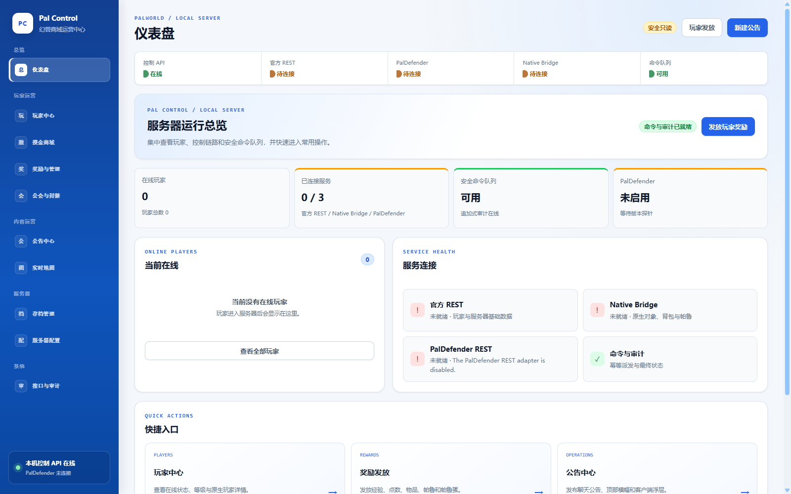
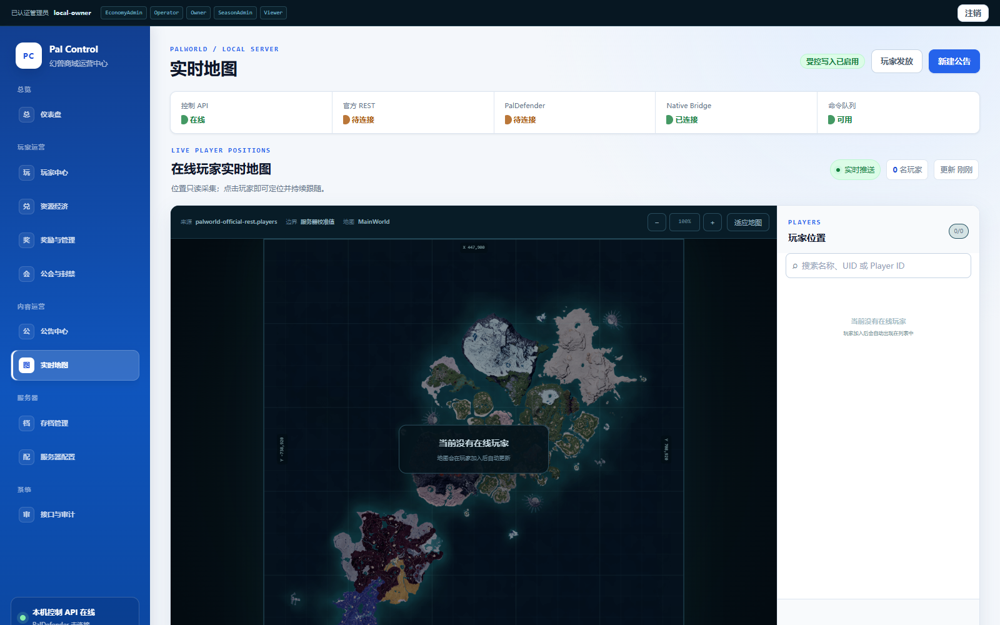
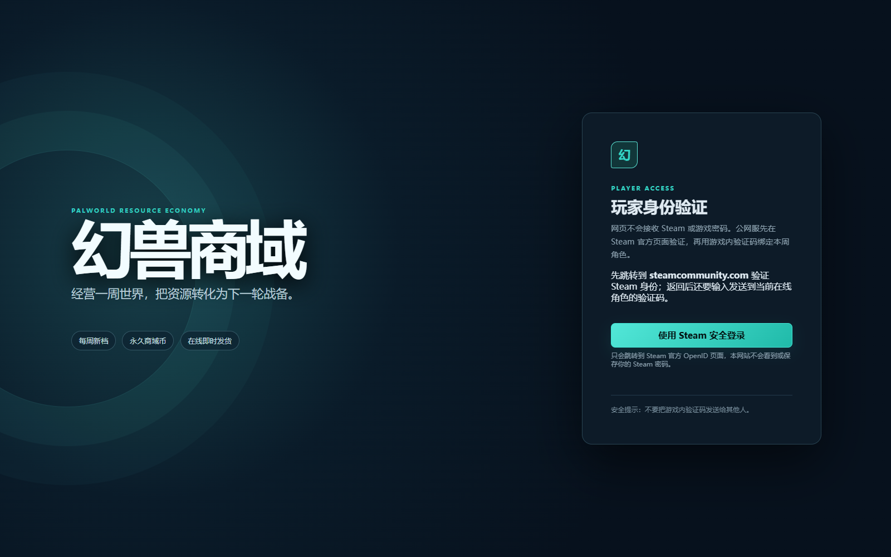
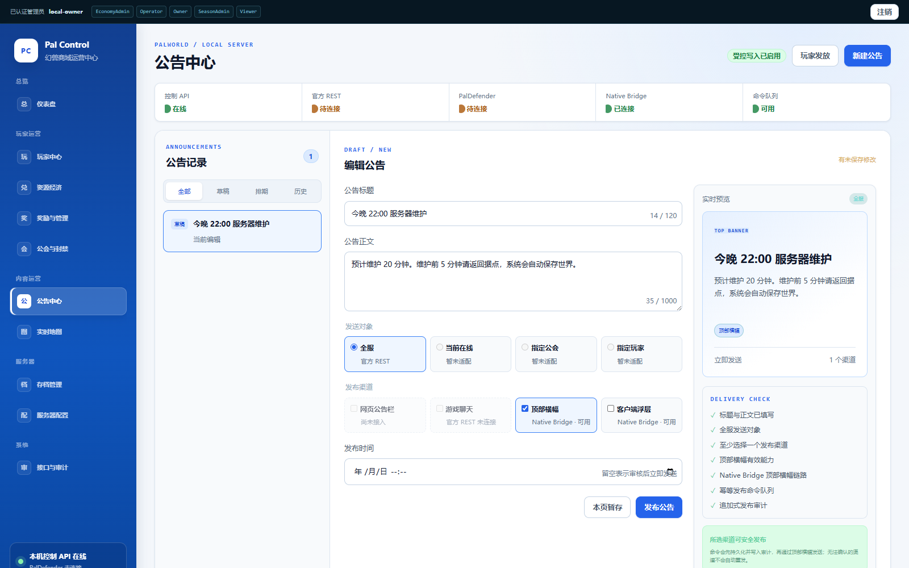
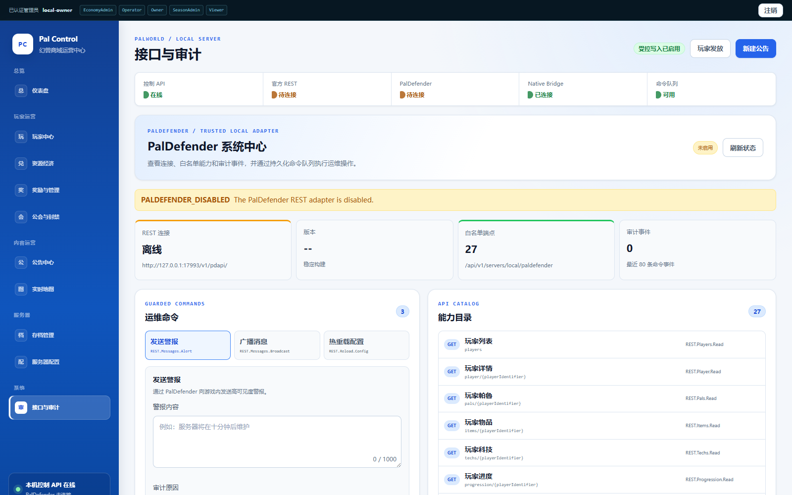
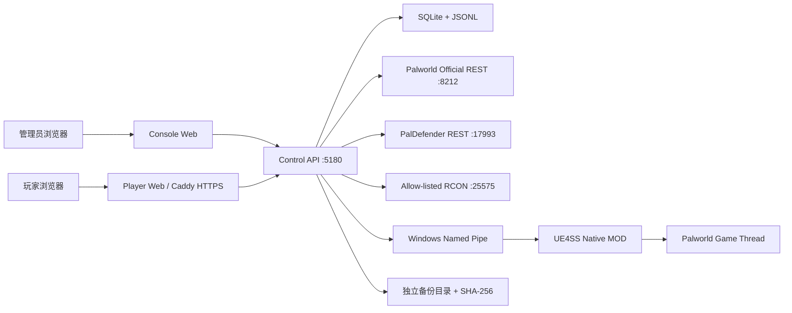

# 幻兽商域（Pal Control）

面向 Windows **Palworld Dedicated Server** 的本机优先运营控制面：包含 React 管理台、玩家自助商城、ASP.NET Core Control API、UE4SS C++ 服务端 MOD，以及“周世界资源经济服”的资源兑换与换档工具。

> 当前定位：已完成指定游戏版本上的本机开发服原型和部分真实联调，**不是可直接暴露到公网的生产系统**。管理 API、Palworld 官方 REST、PalDefender、RCON 与 Native Bridge 必须保持在服务器本机或受信网络内。

本项目是非官方社区项目，与 Pocketpair 或 Palworld 的权利方无隶属、授权或背书关系。游戏名称、商标与游戏素材归各自权利人所有。

## 项目状态

| 项目 | 当前状态 |
| --- | --- |
| 运行平台 | Windows x64；Web/API 在其他平台上的兼容性尚未验证 |
| 前端 | React 19、TypeScript 7、Vite 8 |
| 后端 | ASP.NET Core / .NET 10 |
| 本地状态 | SQLite 经济账本、JSONL 命令队列与审计日志 |
| 原生 MOD | C++23、UE4SS、Windows Named Pipe |
| Native 目标版本 | Palworld `v1.0.0.100427`、UE4SS commit `c2ac246` |
| 发布成熟度 | 本机开发服原型；公网身份、管理员 RBAC、原子背包消费仍是硬门槛 |
| 开源许可证 | [MIT](LICENSE) |

## 界面预览

以下截图由当前代码在隔离的离线演示环境中生成，没有连接真实 Palworld 服务，也不包含玩家账号、服务器路径或密钥。界面中的“待连接”和“安全只读”是默认安全状态。

### 管理控制台



### 在线玩家地图



### 玩家门户登录



<details>
<summary>查看更多界面：公告中心与接口审计</summary>

#### 公告中心



#### 接口与审计



</details>

## 功能概览

### 管理后台

- **服务器仪表盘**：集中显示 Control API、官方 REST、PalDefender、Native Bridge、命令队列、在线玩家和快捷入口。
- **玩家中心**：搜索在线玩家，查看基础资料、公会、等级、经验、背包、帕鲁和科技；Native Bridge 就绪后可使用受控的成长、背包槽位和帕鲁编辑工具。
- **奖励与玩家管理**：通过 PalDefender 发放经验、科技点、远古科技点、物品、帕鲁和帕鲁蛋，支持单项科技学习/遗忘、定向消息、踢出与封禁。
- **公会与封禁目录**：查看公会成员、基地和仓储信息，检索账号/IP 封禁记录并执行白名单内的解封操作。
- **公告中心**：创建、暂存和排期公告，按能力选择游戏聊天、顶部横幅或客户端浮层，并检查发布条件与最终回执。
- **实时地图**：从官方 REST 只读采集在线玩家位置，支持搜索、缩放、拖动、选择与持续跟随。
- **服务器配置**：搜索并分类编辑 `PalWorldSettings.ini`，提供输入校验、差异预览、危险项确认和保存前备份。
- **存档中心**：请求官方保存、复制稳定快照、生成逐文件 SHA-256 清单并复核完整性；不提供恢复、删除、上传或原始 `.sav` 编辑。
- **资源经济运营**：管理永久商域币、每周战备券、商品轮换、库存与限购、订单发货、钱包调账、资源报价、人工对账和周换档。
- **接口与审计**：展示 PalDefender 白名单能力、运维命令和追加式审计记录；所有写操作经过持久化命令队列。

### 玩家门户

- **游戏内验证码登录**：玩家提交平台 UserId/SteamID64，在线角色收到 8 位一次性验证码；网页不收集游戏密码。
- **双币钱包与战备商城**：查看永久商域币、周战备券、商品库存与个人限购，在线购买并跟踪发货状态。
- **订单与资金流水**：只允许玩家查询自己的订单、退款/不确定状态以及购买、活动和资源兑换形成的账本记录。
- **个人兑换点地图**：只返回当前登录玩家的位置、资源兑换点范围、距离和路线提示，不暴露其他玩家坐标。
- **资源报价与兑换**：扫描允许容器中的白名单资源，生成限时整单报价，确认扣物后入账并保留兑换记录。

### 服务端与安全

- **统一 Control API 边界**：浏览器只连接 ASP.NET Core API；官方 REST、PalDefender REST、白名单 RCON 与 Native Bridge 均由服务端封装。
- **幂等队列与最终状态**：公告、通知、存档和 PalDefender 写操作使用 `Idempotency-Key`、持久队列与追加式审计；派发后无法证明结果时进入 `uncertain`，禁止盲目重发。
- **事务经济账本**：SQLite 保存账户、钱包、订单、账本和资源兑换事件，明确失败可退款，不确定结果转人工对账。
- **玩家门户防护**：显式 Origin 白名单、HttpOnly/Secure/SameSite Cookie、CSRF Token、验证码限流、请求限流和并发上限。
- **最小公网暴露**：公网反向代理只能开放玩家门户静态页面和 `/api/v1/player/*`；管理 API、官方 REST、PalDefender、RCON 与 Named Pipe 不应公开。

### UE4SS Native 集成

- **本机 Named Pipe 双工桥**：长度前缀 JSON、hello/heartbeat、受限命令队列和游戏线程命令泵，Unreal 对象只在游戏线程访问。
- **运行时探针与受控写入**：玩家、成长、背包和帕鲁操作使用能力探针、revision、预演与回读校验；背包只修改已有非空槽位，等级/Rank/IV 等高风险字段保持只读。
- **原生通知**：在签名与版本门禁通过后发布顶部横幅、客户端浮层和定向 UI 通知。
- **玩法扩展**：兼容 `!撤离`/`!extract` 本人资源兑换点查询，以及实验性的服务端随机安全复活；反射签名不唯一或版本不匹配时 fail-closed。

### 功能启用条件

| 能力 | 最低依赖 |
| --- | --- |
| 管理台外壳、健康检查、命令队列 | Control API |
| 玩家列表、服务器状态、实时地图 | Palworld 官方 REST |
| 奖励、公会、封禁和 PalDefender 运维 | PalDefender REST 与受限 Token |
| 背包/帕鲁精细工具、顶部横幅、客户端浮层 | 精确版本 UE4SS Native MOD |
| 玩家登录、商城发货与资源兑换 | Player Portal、PalDefender、白名单 RCON 与版本门禁 |

默认配置中 **PalDefender、RCON 和玩家门户全部关闭**。首次启动只能验证基础 Web/API；完整运营能力需要按本文配置外部服务。界面会依据服务端 capabilities 自动禁用未满足条件的写操作。

## 架构



除玩家门户的静态页面和经过严格白名单的 `/api/v1/player/*` 外，图中的服务端接口都不应直接暴露到互联网。

## 目录结构

```text
pal-control/
├─ apps/
│  ├─ console-web/              # 管理控制台
│  └─ player-web/               # 玩家自助商城
├─ services/control-api/        # ASP.NET Core Control API
├─ mods/pal-control-native/     # UE4SS C++ 服务端 MOD 源码
├─ packages/contracts/          # OpenAPI 与 Native Bridge 契约
├─ extraction-mode/             # 玩法设计、换档与检查脚本
├─ deploy/
│  ├─ windows/                  # Windows 配置示例和运维脚本
│  └─ player-portal/            # Caddy 玩家门户模板
├─ docs/                        # 架构、安全与运行手册
├─ tests/                       # 隔离式集成 smoke tests
└─ tools/                       # Bridge smoke 与资源目录工具
```

## 环境要求

基础 Web/API 开发环境：

- Windows 10/11 或 Windows Server x64；
- Node.js `22.12+`；
- npm `11+`；
- .NET SDK `10.0`；
- PowerShell 7 推荐，Windows PowerShell 5.1 未做完整验证；
- Python 3（只在部分隔离式集成测试中使用）。

连接真实游戏服还需要：

- 单独安装的 Palworld Dedicated Server；
- 已启用且只允许本机访问的官方 REST API；
- 可选的 PalDefender；
- Native 功能所需的精确版本 UE4SS 和重新编译的 MOD。

仓库**不包含** SteamCMD、PalServer、UE4SS 运行时、PalDefender 二进制、真实存档或任何游戏服务端文件。

## 快速开始

以下命令均从仓库根目录 `pal-control` 执行。

### 1. 安装依赖

```powershell
npm ci
dotnet restore .\services\control-api\PalControl.ControlApi.csproj
dotnet restore .\tools\bridge-smoke\PalControl.BridgeSmoke.csproj
```

### 2. 创建本地配置

复制不含凭据的示例文件：

```powershell
Copy-Item `
  .\deploy\windows\appsettings.Local.example.json `
  .\services\control-api\appsettings.Local.json
```

编辑 `services/control-api/appsettings.Local.json`，至少确认：

- `Palworld:InstallRoot` 指向本机 `PalServer`；
- `Palworld:OfficialRestApi:BaseUrl` 与服务端 REST 端口一致；
- `Palworld:OfficialRestApi:Password` 与服务端管理员密码一致；
- 未使用的 PalDefender、RCON、Player Portal 保持 `Enabled: false`。

`appsettings.Local.json` 已被 `.gitignore` 排除。不要把密码、Token、Cookie 密钥或公网域名写进 `appsettings.json` 和任何 `*.example.*` 文件。

只验证 Web/API 外壳时可以不启动 PalServer；依赖真实游戏数据的页面会显示离线或降级状态。

资源选择器还需要 `services/control-api/Resources/palworld-resource-catalog.json`。该生成快照因外部数据再分发授权尚未闭环而被刻意排除；只有在你确认 Paldeck、PalCalc、BWIKI 和底层游戏数据条款允许当前用途后，才可在本机运行 `tools/catalogs/update-palworld-resource-catalog.ps1` 或放入经授权的替代目录。不要使用 `git add -f` 上传本机生成结果。

### 3. 启动 Control API

终端一：

```powershell
dotnet run --project .\services\control-api\PalControl.ControlApi.csproj
```

检查进程存活：

```powershell
Invoke-WebRequest http://127.0.0.1:5180/health/live |
  Select-Object -ExpandProperty Content
```

### 4. 启动管理台

终端二：

```powershell
npm run dev:web
```

打开 `http://127.0.0.1:5173`。

### 5. 可选：启动玩家门户

终端三：

```powershell
npm run dev:player
```

打开 `http://127.0.0.1:5175`。默认只能看到登录入口；完整登录还需要启用 `PlayerPortal`、PalDefender 与本机 RCON，并满足已批准的游戏/PalDefender 版本门禁。

### 默认地址

| 服务 | 地址 | 是否允许公网直连 |
| --- | --- | --- |
| 管理台 | `http://127.0.0.1:5173` | 否 |
| 玩家门户开发服务器 | `http://127.0.0.1:5175` | 否 |
| Control API | `http://127.0.0.1:5180` | 否 |
| Palworld 官方 REST | `http://127.0.0.1:8212` | 否 |
| PalDefender REST | `http://127.0.0.1:17993` | 否 |
| 本机 RCON | `127.0.0.1:25575` | 否，禁止端口映射 |

## 使用教程

### 连接 Palworld 服务端

1. 先备份现有世界存档。
2. 在 `PalWorldSettings.ini` 中设置强随机 `AdminPassword`，并启用官方 REST：`RESTAPIEnabled=True`、`RESTAPIPort=8212`。
3. 不要在路由器、云安全组或内网穿透中开放 `8212`、`17993`、`25575`、`5180`。
4. 在私密的 `appsettings.Local.json` 中填写安装目录、REST 地址与密码。
5. 启动 API 后，先确认管理台的服务器信息、在线玩家和 metrics 等只读能力，再逐项启用写能力。

首次服务端启动和 MOD 门禁详见 [首次启动运行手册](docs/runbooks/first-server-start.md)。该文档中的示例路径仅供参考，请替换为自己的安装路径。

### 使用管理台

1. 打开管理台并检查仪表盘依赖状态。
2. 在“玩家中心”中选择在线玩家，读取成长、背包、帕鲁和科技信息。
3. 发放物品、经验、科技或帕鲁前，确认目标玩家、内部资源 ID、数量和审计原因。
4. 公告与通知会分别使用官方 REST 或 Native Bridge；结果为 `uncertain` 时先人工对账，不要重复点击发送。
5. 存档中心只负责保存、复制和校验。任何恢复或替换操作都应停服后按独立维护流程执行。

PalDefender 的安装、Token 文件、版本和权限边界见 [PalDefender 集成运行手册](docs/runbooks/paldefender-integration.md)。

### 使用玩家商城

本地联调时，在 `appsettings.Local.json` 中启用玩家门户，将 `CookieSecure` 临时设为 `false`，并只加入开发地址 `http://127.0.0.1:5175`。公网部署必须恢复安全 Cookie，并按 [玩家门户部署与安全资料](docs/player-portal/README.md) 使用 HTTPS。

玩家登录流程：

1. 角色保持在线；
2. 输入完整平台 UserId，Steam 玩家也可直接输入 17 位 SteamID64；
3. 在游戏内接收 8 位一次性验证码；
4. 回到网页完成验证；
5. 登录后查看钱包、商品、订单、流水和本人资源兑换点地图。

不要让玩家输入游戏密码，也不要让其把验证码发给他人。

### 使用周世界资源经济模式

当前闭环允许出售本周世界允许容器中的任意白名单资源，使用本机 SQLite、PalDefender 发货和白名单 RCON 扣物，仅适合受控开发服。公开经济测试前必须完成平台身份/管理员 RBAC 与 Native 原子背包消费。完整产品规则见 [ADR-0001](docs/architecture/decisions/0001-weekly-world-resource-economy.md)。

只读检查和周换档入口：

```powershell
.\extraction-mode\scripts\Test-ExtractionMode.ps1
.\extraction-mode\scripts\Invoke-WeeklyRollover.ps1 -PlanOnly
```

正式换档前请完整阅读 [幻兽商域模式说明](extraction-mode/README.md)，不要跳过交易关闸、备份验证和未决交易对账。

### Native MOD

Native MOD 与 Palworld/UE4SS 的精确 ABI 绑定。游戏或 UE4SS 更新后必须重新构建，并在只读模式完成探针验证；不匹配时应保持 fail-closed。

源码、目标版本和部署结构见 [Native MOD 文档](mods/pal-control-native/README.md)，依赖锁定见 [`dependencies.lock.json`](mods/pal-control-native/dependencies.lock.json)。本地 `third_party/` 构建树不会提交到仓库；当前仍需补充从全新 clone 可复现的依赖获取与构建脚本，不能把本机已有二进制当作源码发布物。

## 构建

```powershell
npm run build:web
npm run build:player
dotnet publish .\services\control-api\PalControl.ControlApi.csproj `
  -c Release `
  -o .\artifacts\control-api
```

`dist/`、`bin/`、`obj/` 和 `artifacts/` 都是可再生成产物，不应提交到 Git。

## 测试

统一测试入口会运行玩家端单元测试、方案 A 契约测试、结算状态机 harness 和现有隔离 smoke；它们使用本地 fake 与临时目录，不会连接真实 Palworld 服务端：

```powershell
npm test
npm run test:contract
npm run test:integration
```

Windows GitHub Actions 会执行 `npm ci`、两个前端构建、Control API/Bridge smoke/.NET 测试 harness 的 Release 构建和统一测试。结算 harness 已覆盖旧数据兼容、lease/CAS、终态不可倒退、钱包幂等和超过 1000 条的完整周统计，但不模拟真实 RCON；请求取消、RCON 成功后崩溃、入账后崩溃等服务级故障注入仍是公开测试前的 TODO。

## 数据与安全边界

- `services/control-api/data/`：SQLite、命令队列、审计和锁文件，只属于当前运行实例；
- `services/control-api/Resources/palworld-resource-catalog.json`：外部数据生成快照，授权未闭环前只留本机；
- `backups/`：真实存档备份，可能包含玩家标识和服务器状态；
- `appsettings.Local.json`、`.env*`：密码与 Token；
- `PalServer/`、`steamcmd/`、`Saved/`：游戏运行时、Steam 元数据、真实世界和玩家存档；
- `artifacts/`、`output/`、`bin/`、`obj/`、`dist/`、`third_party/`：构建、测试或下载产物。

以上内容均不得提交。完整的上传/排除矩阵、许可证风险和 GitHub 发布步骤见 [开源发布方案](docs/open-source-release.md)。

## 文档索引

- [总体架构](docs/architecture/overview.md)
- [ADR-0001：采用周世界资源经济服](docs/architecture/decisions/0001-weekly-world-resource-economy.md)
- [MOD 能力与接口维护手册](docs/MOD能力与接口维护手册.md)
- [玩家门户部署与安全资料](docs/player-portal/README.md)
- [PalDefender 集成运行手册](docs/runbooks/paldefender-integration.md)
- [存档中心运行手册](docs/runbooks/save-management.md)
- [公告发布运行手册](docs/runbooks/announcement-publishing.md)
- [幻兽商域模式设计](extraction-mode/README.md)
- [玩法完成度与开发 TODO](TODO.md)
- [OpenAPI 契约](packages/contracts/openapi/control-api.yaml)
- [第三方来源与许可证说明](THIRD_PARTY_NOTICES.md)

## 贡献

提交改动前请至少完成相关前端构建、`.NET` Release 构建和受影响的 smoke test。安全边界、幂等语义、`uncertain` 状态、版本探针和回读校验不可为了“方便”而绕过。

涉及漏洞、身份绕过、任意命令执行、存档破坏或经济重复入账的问题，不要附带真实凭据、玩家数据或存档公开提交；仓库公开后应通过 GitHub Security Advisory 私下报告。

## 许可证

Pal Control 源码采用 [MIT License](LICENSE)。第三方资源各自遵循其原许可证和归属声明；MIT 不会覆盖 Palworld 游戏文件、商标或其他第三方内容，详见 [第三方来源与许可证说明](THIRD_PARTY_NOTICES.md)。
