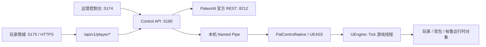

# Pal Control MOD 能力与接口维护手册

> 适用项目：幻兽商域 Palworld Windows Dedicated Server 控制台
> 文档基线日期：2026-07-15
> Control API 协议：HTTP JSON + SSE
> Native Bridge 协议：Named Pipe `1.0`

本文档用于后续开发、联调、运维和故障排查。它记录当前已经实现的能力、接口调用方法、安全约束、部署路径和已知限制。

## 1. 当前运行状态快照

| 项目 | 当前值 | 说明 |
| --- | --- | --- |
| 服务器名称 | `幻兽商域` | 来自官方 REST `/info` |
| 游戏版本 | `v1.0.0.100427` | Native 适配目标版本 |
| 当前进程已加载 MOD | `0.3.0-dev.36` | Bridge 只读探针已于 2026-07-15 验证 |
| 源码声明版本 | `0.3.0-dev.36` | 含受限静态槽清空的实验性 `inventory.consume` 与只读公开撤离点聊天查询 |
| 服务器磁盘 DLL | `0.3.0-dev.36` | SHA-256 `6EF1DCD71DF9FFC3458A20560E10264F1F795753C2ADC8C2E109889A552DE44A` |
| `Info.template.json` | `0.3.0-dev.36` | 与当前源码和运行 DLL 版本一致；尚未据此发布 Workshop 包 |
| Native 协议 | `1.0` | 长度前缀 UTF-8 JSON |
| Control API | `http://127.0.0.1:5180` | 仅回环地址 |
| Web 控制台 | `http://127.0.0.1:5174` | 当前主开发端口 |
| 玩家商城 | `http://127.0.0.1:5175` | 独立玩家入口；公网必须经 HTTPS 反向代理 |
| 官方 REST | `http://127.0.0.1:8212/v1/api/` | 通过防火墙阻止远程访问 |
| 游戏端口 | UDP `8211` | 可做公网映射 |
| Query 端口 | UDP `27015` | 可做公网映射 |
| RCON | 启用（仅供本机控制链路） | `RCONEnabled=True`；Windows 防火墙阻断 TCP `25575` 外部入站 |
| Native Pipe | `\\.\pipe\pal-control.local.v1` | 仅本机进程访问 |

### 当前开发模式约定

1. 当前运行服、磁盘 DLL、源码和模板均为 `0.3.0-dev.36`；Bridge 已验证连接、完整槽元数据可读且不再声明 `inventory.consume.partial-stack-only`。Palworld 保留 `/` 给管理员命令，不能向普通玩家宣传 `/撤离`。`inventory.consume.experimental` 尚未经过“受控玩家扣物 → 保存 → 停服 → 重启 → 重登”验收，仍不得用于公开经济入账。
2. 即使处于开发模式，PalServer 重启也必须先确认无人在线，再通过官方 REST 保存和正常关服；禁止为替换 DLL 强杀进程。
3. 客户端浮层只读探针已验证 `PalGameStateInGame:BroadcastServerNotice` 的参数区为 16 字节、FunctionFlags 为 `0x24CC0`，`publishClientOverlay=true`。

## 2. 系统结构



安全边界：

- 浏览器只能调用 Control API。
- Control API 管理域使用独立 API Key、RBAC 与高风险 TOTP，但仍绝对不能直接暴露到公网。
- 官方 REST 凭据只保存在本机 `appsettings.Local.json`，不要提交到版本库。
- Native MOD 不监听 TCP；只创建本机 Named Pipe。
- 所有 Unreal UObject 查询与修改都在 `UEngine::Tick` 游戏线程执行。

## 3. 目录与关键文件

```text
pal-control/
├─ apps/console-web/                 React/Vite 网页控制台
├─ services/control-api/             ASP.NET Core Control API
│  ├─ appsettings.json               非敏感默认配置
│  ├─ appsettings.Local.json         本机密码等敏感配置，禁止提交
│  └─ data/                          SQLite 经济/发货 outbox、非经济命令 side state 与审计
├─ mods/pal-control-native/          UE4SS C++ MOD 源码
├─ packages/contracts/               HTTP 与 Named Pipe 契约
├─ deploy/windows/                   Windows 启动与部署示例
└─ docs/                             设计、运维与接口文档
```

运行时关键路径：

```text
C:\PalServerRuntime\PalServer.exe
C:\PalServerRuntime\Pal\Saved\Config\WindowsServer\PalWorldSettings.ini
C:\PalServerRuntime\Pal\Binaries\Win64\ue4ss\Mods\PalControlNative\dlls\main.dll
C:\PalServerRuntime\Pal\Binaries\Win64\ue4ss\UE4SS.log
```

## 4. 能力矩阵

| 模块 | 能力 | 状态 | 重要限制 |
| --- | --- | --- | --- |
| 服务器 | 读取版本、名称、World GUID | 可用 | 依赖官方 REST |
| 指标 | FPS、玩家数、帧时间、运行时长等 | 可用 | 依赖官方 REST |
| 玩家 | 读取在线玩家 | 可用 | 官方 REST 只返回在线玩家 |
| 玩家探针 | 读取 `PalPlayerState` 运行时对象 | 可用 | 下线后对象可能为空 |
| 玩家成长 | 等级、经验、未分配属性点、已分配属性、科技点 | 可用 | 玩家角色成长对象加载后可读 |
| 玩家成长写入 | 增加经验、发放点数、分配属性 | 可用 | 只允许在线玩家；单次一种操作；必须预演和 revision 校验 |
| 玩家目标等级 | 按目标等级换算经验 | 未开放 | `PalExpDatabase` 静态 CDO 在当前 UE4SS ABI 下不可安全调用；使用增加经验 |
| 玩家降级 / 洗点 | 降低等级、降低经验、重置属性 | 未开放 | 原生逆向结算链尚未证明，保持 fail-closed |
| 离线玩家编辑 | 直接修改 `.sav` | 未开放 | 与在线 MOD 能力隔离，必须停服后另行设计 |
| 背包 | 读取已加载容器和占用槽位 | 可用 | 不读取离线存档 |
| 背包数量 | 修改现有物品数量 | 可用 | 仅 `common`、`dropSlot`、`food`；数量不能为 0 |
| 背包新增物品 | 新增物品或写空槽位 | 未开放 | 当前保持 fail-closed |
| 装备背包 | 武器、护甲、关键物品写入 | 未开放 | 只读或忽略 |
| 帕鲁 | 读取加载中的帕鲁 | 可用 | 仅 `PalIndividualCharacterParameter` 已加载对象 |
| 帕鲁昵称 | 在线修改 | 可用 | 最长 24 字符，禁止控制字符 |
| 帕鲁收藏 | 在线修改 | 可用 | 原生 `OnRep_SaveParameter` 结算 |
| 被动技能 | 读取、中文目录、原生替换 | 可用 | 每次网页只替换一个词条；API 另有完整词条集修复入口 |
| 主动技能 | 读取已装备、已掌握、切换装备 | 可用 | 只能装备当前已装备或 `MasteredWaza` 中的技能，1–3 个且不能重复 |
| 等级 / Rank / IV | 读取 | 可用 | 修改未开放 |
| 主动技能学习 | 新增未掌握技能 | 未开放 | `ACTIVE_SKILL_NOT_MASTERED` |
| 技能中文 | 原生简体中文名称和描述 | 可用 | 1905 条被动数据中 422 条有官方中文，默认安全目录显示 115 条 |
| 公告聊天 | 官方 REST 全服公告 | 可用 | 仅全服受众 |
| 客户端浮层 | `PalGameStateInGame:BroadcastServerNotice` | 可用 | 发布前可调用只读兼容性探针；无逐客户端 ACK |
| 公告持久化 | 草稿、排期、幂等队列、审计 | 可用 | 不确定结果禁止自动重发 |
| 在线地图 | 实时显示在线玩家位置 | 可用 | 每秒读取官方 REST；不包含离线玩家 |
| 玩家资源兑换点地图 | 本人位置、兑换点、范围圈、距离和路线 | 可用 | 兼容路径 `/api/v1/player/me/extraction-zones`；身份只取玩家会话，每 5 秒刷新 |
| 资源兑换点聊天查询 | 普通玩家兼容别名 `!撤离`、`!extract`（兼容无前缀文本） | 可用 | 只回复发起者；2 秒限流；`/` 是管理员前缀；坐标配置变更后需要同步重编 Native MOD |
| 存档管理 | 保存、原生备份只读目录、独立备份与 SHA-256 校验 | 可用 | 不支持恢复、删除、上传和原始 `.sav` 编辑 |

## 5. HTTP API 通用约定

### 5.1 基础地址

```powershell
$BaseUrl = "http://127.0.0.1:5180"
$Api = "$BaseUrl/api/v1"
$ServerId = "local"
$AdminApiKey = Read-Host "Control API 管理密钥" -AsSecureString
$AdminCredential = [pscredential]::new("operator", $AdminApiKey)
$AdminHeaders = @{
  "X-Pal-Admin-Key" = $AdminCredential.GetNetworkCredential().Password
}
```

除 `/health/*` 外，所有业务接口都带 `/api/v1` 前缀并要求管理员身份。密钥只从密码管理器输入当前 `SecureString` 提示；不要写进脚本、命令参数、仓库或截图。高风险端点还要求对应角色、`X-Pal-Admin-Totp` 和 `X-Pal-Admin-Reason`，具体以运行手册和 OpenAPI 为准。

### 5.2 写接口公共要求

背包、帕鲁和公告写接口都必须注意：

- Header：`Content-Type: application/json`
- Header：`Idempotency-Key: <唯一值>`
- `reason` 至少 3 个字符。
- 先使用 `dryRun: true` 预演。
- 正式写入必须改成 `dryRun: false`，同时换一个新的 `Idempotency-Key`。
- 帕鲁写入必须使用刚读取到的字符串 `revision`。
- 收到 `409` 时重新读取，禁止盲目重试旧请求。

推荐生成幂等键：

```powershell
$Headers = $AdminHeaders.Clone()
$Headers += @{
  "Content-Type" = "application/json"
  "Idempotency-Key" = [guid]::NewGuid().ToString()
}
```

### 5.3 HTTP 状态语义

| 状态码 | 含义 |
| --- | --- |
| `200` | 读取成功或同步命令成功 |
| `201` | 公告草稿首次创建 |
| `202` | 公告发布命令已进入队列 |
| `400` | 参数、幂等键、reason 或写入范围不合法 |
| `404` | 玩家、公告、命令或运行时对象不存在 |
| `409` | revision、槽位、幂等键或状态冲突 |
| `422` | Native MOD 拒绝操作，例如技能未掌握或原生校验失败 |
| `503` | 官方 REST 或 Native Bridge 不可用 |

错误结构：

```json
{
  "code": "REVISION_CONFLICT",
  "message": "The Pal changed after it was read; refresh before retrying.",
  "traceId": null
}
```

## 6. HTTP 接口总表

### 6.1 健康检查

| 方法 | 路径 | 用途 |
| --- | --- | --- |
| GET | `/health/live` | Control API 进程存活检查 |
| GET | `/health/ready` | 官方 REST 与 Bridge 聚合状态 |

### 6.2 服务器与能力

| 方法 | 路径 | 数据来源 |
| --- | --- | --- |
| GET | `/api/v1/servers/{serverId}/capabilities` | Control API 聚合 |
| GET | `/api/v1/servers/{serverId}/info` | 官方 REST `/info` |
| GET | `/api/v1/servers/{serverId}/players` | 官方 REST `/players` |
| GET | `/api/v1/servers/{serverId}/metrics` | 官方 REST `/metrics` |
| GET | `/api/v1/servers/{serverId}/bridge/status` | Native Bridge 状态 |

### 6.3 Native 诊断接口

| 方法 | 路径 | 对应 Native operation |
| --- | --- | --- |
| GET | `/api/v1/servers/{serverId}/players/native-probe` | `players.probe` |
| GET | `/api/v1/servers/{serverId}/players/native-schema` | `players.schema` |
| GET | `/api/v1/servers/{serverId}/players/progression/native-schema` | `players.progression.schema` |
| GET | `/api/v1/servers/{serverId}/players/progression/native-probe` | `players.progression.probe` |
| GET | `/api/v1/servers/{serverId}/inventory/native-probe` | `inventory.probe` |
| GET | `/api/v1/servers/{serverId}/inventory/native-schema` | `inventory.schema` |
| GET | `/api/v1/servers/{serverId}/pals/native-probe` | `pals.probe` |
| GET | `/api/v1/servers/{serverId}/pals/native-schema` | `pals.schema` |
| GET | `/api/v1/servers/{serverId}/pals/skill-catalog` | `pals.skills.catalog` |
| GET | `/api/v1/servers/{serverId}/announcements/client-overlay/probe` | `announcements.overlay.probe` |

`native-schema` 接口用于版本升级时检查反射字段和函数签名，不应在普通页面高频调用。

### 6.4 玩家数据与修改

| 方法 | 路径 | 用途 |
| --- | --- | --- |
| GET | `/api/v1/servers/{serverId}/players/{playerId}/progression` | 读取玩家成长快照与 revision |
| POST | `/api/v1/servers/{serverId}/players/{playerId}/progression/mutations` | 预演或执行一项玩家成长修改 |
| GET | `/api/v1/servers/{serverId}/players/{playerId}/inventory` | 读取指定玩家背包 |
| POST | `/api/v1/servers/{serverId}/players/{playerId}/inventory/transactions` | 修改现有背包槽位数量 |
| GET | `/api/v1/servers/{serverId}/players/{playerId}/pals` | 读取指定玩家的已加载帕鲁 |
| POST | `/api/v1/servers/{serverId}/players/{playerId}/pals/{instanceId}/mutations` | 修改帕鲁白名单字段 |

### 6.5 公告、命令和审计

| 方法 | 路径 | 用途 |
| --- | --- | --- |
| GET | `/api/v1/servers/{serverId}/announcements` | 公告列表 |
| POST | `/api/v1/servers/{serverId}/announcements` | 创建公告草稿 |
| GET | `/api/v1/servers/{serverId}/announcements/{announcementId}` | 公告详情 |
| POST | `/api/v1/servers/{serverId}/announcements/{announcementId}/publish` | 提交发布命令 |
| GET | `/api/v1/commands/{commandId}` | 查询命令状态 |
| GET | `/api/v1/audit/commands?limit=100` | 查询命令审计 |
| GET | `/api/v1/events` | SSE 心跳，目前每 15 秒发送一次 |

## 7. 常用读取调用

### 7.1 查看当前能力

```powershell
Invoke-RestMethod "$Api/servers/local/capabilities" -Headers $AdminHeaders |
  ConvertTo-Json -Depth 8
```

调用写接口前，应先检查相应字段：

```text
officialRestConnected
bridgeConnected
readInventory / writeInventory
readPals / writePals
readPlayerProgression / writePlayerProgression
publishChatAnnouncements
publishClientOverlay
```

### 7.2 查看当前实际 MOD 版本

```powershell
Invoke-RestMethod "$Api/servers/local/bridge/status" -Headers $AdminHeaders |
  Select-Object connected, protocolVersion, gameBuild, modVersion,
    capabilities, probes, lastSeenAt, lastError
```

### 7.3 玩家与指标

```powershell
$Players = Invoke-RestMethod "$Api/servers/local/players" -Headers $AdminHeaders
$Metrics = Invoke-RestMethod "$Api/servers/local/metrics" -Headers $AdminHeaders
$Players.items
$Metrics
```

### 7.4 读取帕鲁技能目录

```powershell
$Catalog = Invoke-RestMethod "$Api/servers/local/pals/skill-catalog" -Headers $AdminHeaders
$Catalog.passiveSkills |
  Where-Object { -not $_.internal } |
  Select-Object id, name, description, rank, polarity, effects
```

被动技能条目示例：

```json
{
  "id": "PAL_sadist",
  "name": "虐待狂",
  "description": "",
  "rank": 1,
  "category": "SortDisplayable",
  "polarity": "positive",
  "localized": true,
  "obtainable": true,
  "internal": false,
  "effects": [
    { "type": "ShotAttack", "value": 15, "target": "ToSelf" },
    { "type": "Defense", "value": -15, "target": "ToSelf" }
  ]
}
```

写入时永远传 `id`，不能传中文 `name`。

### 7.5 玩家成长读取与修改

读取当前加载的玩家成长数据：

```powershell
$PlayerId = "<OwnerPlayerUId 或 8 位短 UID>"
$Progression = Invoke-RestMethod `
  "$Api/servers/local/players/$PlayerId/progression" `
  -Headers $AdminHeaders
$Progression | ConvertTo-Json -Depth 8
```

重要字段：

- `level` / `totalExperience` / `experienceToNextLevel`。
- `unusedStatusPoints`：未分配属性点。
- `statusPoints[]`：`StatusName_*` 与已分配等级。
- `technologyPoints` / `ancientTechnologyPoints`。
- `revision`：64 位字符串，不要转换成 JavaScript Number。

增加经验的预演请求：

```powershell
$Headers = $AdminHeaders.Clone()
$Headers += @{
  "Content-Type" = "application/json"
  "Idempotency-Key" = [guid]::NewGuid().ToString()
}
$Body = @{
  expectedRevision = $Progression.revision
  reason = "开发服经验测试"
  dryRun = $true
  patch = @{ addExperience = 5000 }
} | ConvertTo-Json -Depth 6
Invoke-RestMethod `
  "$Api/servers/local/players/$PlayerId/progression/mutations" `
  -Method Post -Headers $Headers -Body $Body
```

确认预演后，把 `dryRun` 改为 `false` 并换一个新的 `Idempotency-Key`。其他操作将 `patch` 换成以下之一：

```json
{ "grantStatusPoints": 5 }
{ "grantTechnologyPoints": 10 }
{ "grantAncientTechnologyPoints": 2 }
{
  "allocateStatusId": "StatusName_AddMaxHP",
  "allocateStatusPoints": 1
}
```

允许分配的属性 ID：

```text
StatusName_AddMaxHP
StatusName_AddMaxSP
StatusName_AddPower
StatusName_AddMaxInventoryWeight
StatusName_AddWorkSpeed
StatusName_AddCaptureLevel
```

增加经验通过当前玩家 `PalCheatManager.AddPlayerExp` 的服务端本地原生函数完成，避免 `Debug_AddPlayerExp_ToServer` RPC 派发后在同一 Tick 无法证明结算的问题。专用服务器默认可能不创建玩家的 `CheatManager`；写入链会按 UE4SS `CheatManagerEnablerMod` 的方式，以玩家控制器为 Outer 构造 `/Script/Pal.PalCheatManager` 并写回 `CheatManager` 属性。`PalExpDatabase` 的等级换算函数虽然可以反射到，但当前 Palworld 专用 UE4SS 调用其 class default object 会导致服务进程退出，因此 `targetLevel` 保持 fail-closed；不要绕过限制。科技点和额外属性点同样使用当前玩家的 `PalCheatManager` 原生函数。所有正式写入都必须回读目标字段；函数已派发但回读不符合预期时返回 `503`/`PLAYER_NATIVE_SETTLEMENT_VERIFY_FAILED`，Control API 对经验写入允许最多约 1.2 秒的跨 Tick 回读确认，仍无法证明时不得自动重试。

## 8. 背包调用方式

### 8.1 读取玩家背包

```powershell
$PlayerId = "<ownerPlayerUId 或 playerId>"
$Inventory = Invoke-RestMethod "$Api/servers/local/players/$PlayerId/inventory" -Headers $AdminHeaders
$Inventory.containers | ForEach-Object {
  $_.slots | Select-Object @{n="containerKind";e={$_.PSParentPath}}, slotId, itemId, quantity
}
```

响应的重要字段：

- `revision`：背包读取快照版本，目前网页数量写入使用 `0`，真正冲突保护依赖 `expectedQuantity`。
- `containers[].containerId`：容器 GUID。
- `containers[].kind`：容器类型。
- `slots[].slotId`：格式 `<containerKind>:<slotIndex>`。
- `slots[].itemId`：游戏内部物品 ID。
- `slots[].quantity`：当前数量。

### 8.2 修改现有槽位数量

```powershell
$PlayerId = "<ownerPlayerUId>"
$Headers = $AdminHeaders.Clone()
$Headers += @{
  "Content-Type" = "application/json"
  "Idempotency-Key" = [guid]::NewGuid().ToString()
}

$Body = @{
  expectedRevision = 0
  reason = "运维测试：调整现有背包物品数量"
  dryRun = $true
  operations = @(
    @{
      type = "setQuantity"
      itemId = "PalSphere"
      quantity = 100
      slotId = "common:2"
      containerId = "<container-guid>"
      expectedQuantity = 95
      durability = $null
    }
  )
} | ConvertTo-Json -Depth 8

Invoke-RestMethod `
  -Method Post `
  -Uri "$Api/servers/local/players/$PlayerId/inventory/transactions" `
  -Headers $Headers `
  -Body $Body
```

限制：

- 一次只能提交一个 operation。
- `type` 只能是 `setQuantity`。
- 数量范围 `1..999999`。
- 仅 `common`、`dropSlot`、`food`。
- 必须匹配当前 `itemId`、槽位和 `expectedQuantity`。
- 不支持清零、删除、新增、写空槽位。
- 写后调用：
  - `PalItemContainer.OnUpdateSlotContent`
  - `PalPlayerInventoryData.OnUpdateInventoryContainer`
- 聚合数量或回读失败会回滚；无法确认回滚时返回 `uncertain`。

## 9. 帕鲁调用方式

### 9.1 读取已加载帕鲁

读取全部已加载帕鲁：

```powershell
$Probe = Invoke-RestMethod "$Api/servers/local/pals/native-probe" -Headers $AdminHeaders
$Probe.pals | Select-Object instanceId, ownerPlayerUId, characterId,
  nickname, level, rank, exp, passiveSkills, activeSkills, revision
```

读取指定玩家：

```powershell
$PlayerId = "<ownerPlayerUId>"
Invoke-RestMethod "$Api/servers/local/players/$PlayerId/pals" -Headers $AdminHeaders
```

帕鲁 `revision` 在 HTTP 返回中是字符串，调用写接口时不要转成 JavaScript Number，避免 64 位整数精度丢失。

### 9.2 修改昵称或收藏

```powershell
$PlayerId = "<ownerPlayerUId>"
$InstanceId = "<pal-instance-id>"
$Revision = "<刚读取的 revision 字符串>"

$Headers = $AdminHeaders.Clone()
$Headers += @{
  "Content-Type" = "application/json"
  "Idempotency-Key" = [guid]::NewGuid().ToString()
}

$Body = @{
  expectedRevision = $Revision
  reason = "运维测试：修改帕鲁昵称与收藏"
  requireState = "loaded"
  dryRun = $true
  patch = @{
    nickname = "测试昵称"
    favorite = $true
  }
} | ConvertTo-Json -Depth 8

Invoke-RestMethod `
  -Method Post `
  -Uri "$Api/servers/local/players/$PlayerId/pals/$InstanceId/mutations" `
  -Headers $Headers `
  -Body $Body
```

### 9.3 替换一个被动技能

```powershell
$Body = @{
  expectedRevision = "<刚读取的 revision>"
  reason = "运维测试：替换第一个被动技能"
  requireState = "loaded"
  dryRun = $true
  patch = @{
    passiveSkill = @{
      index = 0
      expectedSkillId = "PAL_sadist"
      skillId = "Noukin"
    }
  }
} | ConvertTo-Json -Depth 8
```

校验规则：

- `index` 必须存在。
- `expectedSkillId` 必须与当前位置完全匹配。
- 新技能必须存在于服务端技能目录。
- 同一帕鲁不能出现重复被动技能。
- 网页一次只允许改一条。
- Native 使用 `RemovePassiveSkill` + `AddPassiveSkill` 重新构造目标列表，再调用 `OnRep_SaveParameter`。
- SaveParameter、Mirror 和回读任一不一致都会执行原生回滚。

### 9.4 完整被动技能集修复接口

该入口主要用于开发环境或修复异常词条列表，网页不直接开放：

```json
{
  "expectedRevision": "<revision>",
  "reason": "修复被动技能列表",
  "requireState": "loaded",
  "dryRun": true,
  "patch": {
    "expectedPassiveSkills": [
      "PAL_sadist",
      "CoolTimeReduction_Up_2",
      "PAL_Sanity_Down_3"
    ],
    "passiveSkills": [
      "Noukin",
      "CoolTimeReduction_Up_2",
      "PAL_Sanity_Down_3"
    ]
  }
}
```

两组数组必须同时提供，目标列表必须有 `1..4` 个唯一合法 ID。

### 9.5 切换已掌握主动技能装备

```json
{
  "expectedRevision": "<revision>",
  "reason": "切换已掌握主动技能",
  "requireState": "loaded",
  "dryRun": true,
  "patch": {
    "equippedActiveSkills": [
      "PowerShot",
      "AirCanon"
    ]
  }
}
```

限制：

- 必须保留 `1..3` 个唯一技能。
- 只能使用当前已装备技能或 `activeSkills.mastered` 返回的技能。
- 不会学习新技能。
- Native 使用 `ClearEquipWaza` + `AddEquipWaza` + `OnRep_SaveParameter`。

## 10. 公告调用方式

### 10.1 创建公告草稿

```powershell
$Headers = $AdminHeaders.Clone()
$Headers += @{
  "Content-Type" = "application/json"
  "Idempotency-Key" = [guid]::NewGuid().ToString()
}

$Body = @{
  title = "服务器维护通知"
  body = "服务器将在 10 分钟后维护，请提前返回据点。"
  audience = @{
    type = "global"
    ids = $null
  }
  channels = @("chat")
  publishAt = $null
  expiresAt = $null
} | ConvertTo-Json -Depth 8

$Announcement = Invoke-RestMethod `
  -Method Post `
  -Uri "$Api/servers/local/announcements" `
  -Headers $Headers `
  -Body $Body
```

限制：

- 标题必填，最多 120 字符。
- 正文必填，最多 1000 字符。
- 当前 audience 只能是 `global`，且 `ids` 必须为空。
- channel 只能从 `chat`、`client-overlay` 中选择且不能重复。
- 当前运行实例的 `chat` 与 `client-overlay` 均可用，也可同时选择。

### 10.2 发布公告

```powershell
$PublishHeaders = $AdminHeaders.Clone()
$PublishHeaders += @{
  "Idempotency-Key" = [guid]::NewGuid().ToString()
}

$Command = Invoke-RestMethod `
  -Method Post `
  -Uri "$Api/servers/local/announcements/$($Announcement.announcementId)/publish" `
  -Headers $PublishHeaders

Invoke-RestMethod "$BaseUrl$($Command.statusUrl)" -Headers $AdminHeaders
```

公告命令状态：

```text
accepted -> dispatched -> succeeded
                         -> failed
                         -> uncertain
```

`uncertain` 表示请求已发出但无法确认结果，系统不会自动重发，以免玩家收到重复公告。

### 10.3 审计文件

```text
services/control-api/data/announcement-events.jsonl
services/control-api/data/command-audit.jsonl
services/control-api/data/command-queue.lock
```

`data/` 已被 `.gitignore` 排除，不应提交。

## 11. Native Bridge 参考

### 11.1 传输格式

```text
uint32 little-endian payloadLength
payloadLength bytes UTF-8 JSON
```

限制：

- 单帧最大 `1,048,576` 字节。
- 命令队列最大 128。
- 结果队列最大 128。
- 每个 Engine Tick 最多处理 4 条命令。
- Pipe DACL 只允许 Local SYSTEM、Administrators 和对象所有者。

### 11.2 已实现 operation

| Operation | 类型 | 说明 |
| --- | --- | --- |
| `players.probe` | 只读 | 枚举 `PalPlayerState` |
| `players.schema` | 只读诊断 | 输出玩家反射字段和候选函数 |
| `players.progression.schema` | 只读诊断 | 输出成长字段、科技字段和原生函数签名 |
| `players.progression.probe` | 只读 | 读取加载中的玩家成长快照 |
| `players.progression.mutate` | 受控写入 | 经验、目标等级、属性点、科技点和属性分配 |
| `inventory.probe` | 只读 | 读取已加载背包和容器 |
| `inventory.schema` | 只读诊断 | 输出背包相关类型结构 |
| `inventory.mutate` | 受控写入 | 修改已占用槽位数量 |
| `pals.probe` | 只读 | 读取已加载帕鲁快照 |
| `pals.schema` | 只读诊断 | 输出帕鲁相关字段和函数 |
| `pals.skills.catalog` | 只读 | 主动/被动技能目录与 `zh-Hans` 文本 |
| `pals.mutate` | 受控写入 | 昵称、收藏、被动替换、主动装备 |
| `announcements.overlay.probe` | 只读诊断 | 校验唯一 authoritative GameState、函数 owner、flags 与单一 FString 参数，不调用 `ProcessEvent` |
| `announcements.overlay.send` | 受控写入，`dev.15` | 调用 `PalGameStateInGame:BroadcastServerNotice`；返回广播尝试数但不伪造客户端 ACK |

### 11.3 Command envelope

```json
{
  "protocolVersion": "1.0",
  "messageType": "command",
  "messageId": "<uuid>",
  "sentAt": "<ISO-8601>",
  "commandId": "<uuid>",
  "idempotencyKey": "<8-128 chars>",
  "requestHash": "<sha256 lowercase hex>",
  "serverId": "local",
  "actorId": "control-api",
  "operation": "pals.probe",
  "deadline": "<ISO-8601>",
  "expectedRevision": 0,
  "reason": "read-only loaded Pal snapshot",
  "payload": {}
}
```

网页或第三方系统不应直接连接 Pipe；统一调用 Control API。

## 12. 安全与一致性规则

### 12.1 Fail-closed

出现以下情况时写能力必须关闭：

- Bridge 未连接。
- 游戏版本或 MOD ABI 不匹配。
- 反射字段未找到。
- 原生函数签名不匹配。
- 目标对象不在当前服务端进程内加载。
- owner UID 不匹配。
- revision、物品 ID、旧数量或旧技能不匹配。

### 12.2 UObject 生命周期

- 不在 Pipe 工作线程缓存或解引用 UObject。
- Pipe 只负责 JSON、长度校验和队列。
- 所有对象查找、字段读取、函数调用都必须在游戏线程执行。
- HTTP 返回中不得暴露指针或内存地址。
- `ephemeralObjectId` 只用于诊断，不可作为长期业务 ID。

### 12.3 稳定 ID

- 玩家：`OwnerPlayerUId` / 官方 REST `userId`。
- 帕鲁：`PalInstanceID`。
- 背包容器：容器 GUID。
- 背包槽位：`containerKind + slotIndex`。
- 技能写入：游戏内部技能 `id`，中文名称仅展示。

## 13. 配置与网络

### 13.1 Control API 配置

默认配置：

```text
services/control-api/appsettings.json
```

本机敏感覆盖：

```text
services/control-api/appsettings.Local.json
```

敏感文件只应包含类似内容：

```json
{
  "Palworld": {
    "OfficialRestApi": {
      "Password": "<AdminPassword>"
    }
  }
}
```

不要把管理员密码写入 README、日志、前端环境变量或 Git。

### 13.2 当前网络暴露

| 端口 | 协议 | 绑定/规则 | 是否外网映射 |
| --- | --- | --- | --- |
| `5173` | TCP | `127.0.0.1` | 否 |
| `5180` | TCP | `127.0.0.1` | 否 |
| `8212` | TCP | PalServer 监听 `0.0.0.0`，Windows 防火墙 Block | 否 |
| `8211` | UDP | Windows 防火墙 Allow | 是，游戏连接 |
| `27015` | UDP | Windows 防火墙 Allow | 是，查询/发现 |
| `25575` | TCP | RCON 已启用并监听 `0.0.0.0`；Windows 防火墙所有配置文件 Block | 否，严禁映射 |

特别注意：CORS 不是身份认证。即使配置了 AllowedOrigins，也不能将 `5180` 暴露到公网。

## 14. 构建与启动

### 14.1 Web

```powershell
Set-Location "C:\src\pal-control"
npm ci
npm run build:web
npm run dev:web
```

### 14.2 Control API

```powershell
Set-Location "C:\src\pal-control"
dotnet build .\services\control-api\PalControl.ControlApi.csproj -c Release
dotnet run --project .\services\control-api\PalControl.ControlApi.csproj -c Release --no-build
```

如果 Release EXE 正在运行导致构建文件锁定，可输出到独立检查目录：

```powershell
dotnet build .\services\control-api\PalControl.ControlApi.csproj `
  -c Release `
  -p:UseAppHost=false `
  -o .\artifacts\control-api-check
```

### 14.3 Native MOD

Native 构建必须使用 `mods/pal-control-native/dependencies.lock.json` 锁定的 UE4SS
提交。构建入口不会为调用者 clone、fetch 或 checkout UE4SS，也不会复制 DLL、停止或重启
PalServer。执行前应准备完整的 UE4SS 子模块，并在其
`cppmods/CMakeLists.txt` 中接入指向当前源码的 `PalControlNative` 目录。
上游 UE4SS CMake 在首次生成独立构建目录时，仍可能在该目录内下载其自身锁定的第三方
编译依赖。

```powershell
Set-Location "C:\src\pal-control"

.\mods\pal-control-native\scripts\Build-PalControlNative.ps1 `
  -Ue4ssRoot .\third_party\RE-UE4SS-Palworld-c2ac246
```

脚本会同时校验：

- `RE-UE4SS` 当前 HEAD 必须等于锁文件中的完整 `sourceCommit`；
- `deps/first/Unreal` 当前 HEAD 必须等于该 UE4SS 提交记录的 gitlink；
- UE4SS 的 `cppmods/PalControlNative` 必须与仓库中的 Native 源码一致；
- CMake、Rust 版本必须等于锁文件版本。

任一版本不符都会立即失败，且不会替调用者切换版本。只检查依赖和源码接入、不执行
CMake 时可使用：

```powershell
.\mods\pal-control-native\scripts\Build-PalControlNative.ps1 `
  -Ue4ssRoot .\third_party\RE-UE4SS-Palworld-c2ac246 `
  -GuardOnly
```

默认使用按 UE4SS commit 隔离且位于 UE4SS 源码树外的构建目录。输出文件：

```text
.agent-build\native\pal-control-native-c2ac246447a8\Game__Shipping__Win64\bin\PalControlNative.dll
```

重复执行同一命令会复用这个提交专属的 CMake 缓存并进行增量构建。若显式传入
`-BuildDirectory`，脚本仍会拒绝 UE4SS 源码树内部的目录以及来源不一致的旧缓存。

### 14.4 发布 Native MOD

发布前必须先统一以下版本：

```text
mods/pal-control-native/Info.template.json
mods/pal-control-native/Source/PalControl/Private/dllmain.cpp
```

部署步骤：

1. 确认目标目录是 `C:\PalServerRuntime`。
2. 停止 `PalServer-Win64-Shipping-Cmd.exe` 和 `PalServer.exe`。
3. 确认进程已退出后复制 DLL。
4. 隐藏窗口启动 `C:\PalServerRuntime\PalServer.exe -log`。
5. 轮询 Bridge 状态，确认 `connected=true` 和 `modVersion` 正确。
6. 调用 schema/probe/skill-catalog 做只读冒烟测试。
7. 最后使用 `dryRun=true` 验证写入链路。

部署目标：

```text
C:\PalServerRuntime\Pal\Binaries\Win64\ue4ss\Mods\PalControlNative\dlls\main.dll
```

## 15. 故障排查

### Control API 离线

```powershell
Invoke-RestMethod http://127.0.0.1:5180/health/live
Get-CimInstance Win32_Process |
  Where-Object Name -match "dotnet|PalControl"
```

### Bridge 未连接

```powershell
Invoke-RestMethod "$Api/servers/local/bridge/status" -Headers $AdminHeaders
Get-Content C:\PalServerRuntime\Pal\Binaries\Win64\ue4ss\UE4SS.log -Tail 200
```

检查：

- `main.dll` 是否存在。
- UE4SS 是否加载 `PalControlNative`。
- Pipe 名称是否一致。
- Control API 是否在 MOD 启动后重新连接。
- `gameBuild` 和 `modVersion` 是否与当前源码一致。

### 网页显示 API 离线但 API 实际正常

页面首次加载可能早于 API/Bridge 握手，等待 1–2 秒或刷新页面。也可验证 Vite 代理：

```powershell
Invoke-RestMethod http://127.0.0.1:5174/api/v1/servers/local/capabilities -Headers $AdminHeaders
```

### 帕鲁或背包列表为空

这通常不表示存档为空，而是目标运行时对象没有加载：

- 玩家可能已经下线。
- PalBox、背包或区域尚未载入服务端进程。
- owner UID 与请求 ID 不一致。
- 重启后需要等待世界和玩家对象加载。

### `REVISION_CONFLICT`

重新读取帕鲁，使用新的 `revision` 重建请求。不要重复发送旧 body。

### `INVENTORY_SLOT_CONFLICT`

重新读取背包，核对：

- `containerId`
- `containerKind`
- `slotIndex`
- `itemId`
- `expectedQuantity`

### 技能搜索找不到

- 中文搜索只覆盖游戏正式提供的 `zh-Hans` 文本。
- 默认隐藏 `SortNotDisplayable` 和无正式中文的内部条目。
- 打开“显示无中文/内部技能”后可按内部 ID 搜索全部 1905 条。
- 即使能在目录中找到，Native 仍可能根据掌握状态或重复技能规则拒绝写入。

## 16. 常见错误码速查

| 错误码 | 处理方式 |
| --- | --- |
| `IDEMPOTENCY_KEY_REQUIRED` | 增加 `Idempotency-Key` Header |
| `IDEMPOTENCY_KEY_REUSED` | 同一键对应了不同请求；生成新键 |
| `REASON_REQUIRED` | 提供至少 3 字符的修改原因 |
| `PAL_NOT_LOADED` | 让目标帕鲁进入加载状态后重试 |
| `PAL_OWNER_MISMATCH` | 核对 playerId/owner UID |
| `REVISION_CONFLICT` | 重新读取帕鲁 revision |
| `PASSIVE_SKILL_NOT_IN_CATALOG` | 使用 skill-catalog 返回的 ID |
| `DUPLICATE_PASSIVE_SKILL` | 选择未在其他词条出现的技能 |
| `ACTIVE_SKILL_NOT_MASTERED` | 只能装备 `mastered` 或当前已装备技能 |
| `INVENTORY_SLOT_CONFLICT` | 重新读取物品、槽位与旧数量 |
| `INVENTORY_CONTAINER_READ_ONLY` | 仅修改 common/dropSlot/food |
| `PAL_NATIVE_SETTLEMENT_VERIFY_FAILED` | Native 已尝试回滚；检查日志和回读状态 |
| `INVENTORY_NATIVE_SETTLEMENT_VERIFY_FAILED` | 检查回滚与聚合数量，禁止直接重放 |
| `PAL_SKILL_CATALOG_UNAVAILABLE` | 检查 Bridge capability 和 MOD 版本 |
| `ANNOUNCEMENT_PUBLISH_UNAVAILABLE` | 检查目标 channel 的 capability |

## 17. 版本升级维护清单

Palworld、UE4SS 或 MOD 升级时按顺序执行：

1. 记录当前游戏版本、UE4SS commit、MOD 版本。
2. 先运行 `players/native-schema`、`inventory/native-schema`、`pals/native-schema`。
3. 核对玩家、背包和帕鲁关键字段是否仍存在。
4. 核对原生函数参数签名：
   - `OnUpdateSlotContent`
   - `OnUpdateInventoryContainer`
   - `RemovePassiveSkill`
   - `AddPassiveSkill`
   - `ClearEquipWaza`
   - `AddEquipWaza`
   - `OnRep_SaveParameter`
   - `BroadcastServerNotice`
5. 运行所有只读 probe。
6. 检查技能目录数量、中文数量和已知技能映射。
7. 使用 `dryRun=true` 测试背包和帕鲁修改。
8. 使用开发数据进行一次可逆真实修改和回读。
9. 验证失败回滚路径。
10. 更新本文档的运行状态快照和版本差异。

## 18. 当前已知限制与后续维护方向

- Control API 已接入独立管理员 API Key、五级 RBAC、高风险 TOTP 与持久审计，并继续强制仅本机访问；玩家 Cookie 不属于管理身份。
- 当前读取的是运行时已加载对象，不是完整离线存档索引。
- Native 通用槽位编辑仍不能新增物品；资源兑换专用 `inventory.consume` 可以减少既有普通静态堆叠，并在完整动态元数据可验证时安全清空最后一件。动态/腐化槽位、装备耐久和任意容器编辑仍未开放；发放物品继续使用 PalDefender 结构化 grant receipt。
- 帕鲁等级、Rank、IV 和主动技能学习保持只读。
- 中文目录中的内部技能可能不适合普通帕鲁，网页默认隐藏。
- 客户端浮层没有逐客户端应用层 ACK；Native 成功表示可靠多播 RPC 已在游戏线程调用，实际显示仍以客户端观察为准。
- MOD 管理和通用日志审计页面仍有未接入入口；在线地图与存档中心已经接入。
- Palworld 的 REST `8212/TCP` 可能监听 `0.0.0.0`；Control API 使用 loopback 地址并不等于远程隔离。每次部署都必须确认 Windows 防火墙没有对 PalServer 放行该 TCP 端口，且路由器/云安全组没有映射。
- 可选 RCON `25575/TCP` 同样可能监听所有接口，只能用于 Development 诊断或人工应急；必须阻断所有远程入站并严禁外网映射。正式资源兑换不依赖 RCON。

## 19. 源码定位

| 内容 | 文件 |
| --- | --- |
| HTTP 路由 | `services/control-api/Program.cs` |
| HTTP DTO | `services/control-api/Domain/Models.cs` |
| 官方 REST 客户端 | `services/control-api/Infrastructure/PalworldRestClient.cs` |
| Bridge 客户端 | `services/control-api/Infrastructure/NativeBridgeClient.cs` |
| 能力聚合 | `services/control-api/Infrastructure/BridgeState.cs` |
| 公告队列与审计 | `services/control-api/Infrastructure/AnnouncementCommandQueue.cs` |
| 存档发现、复制与校验 | `services/control-api/Infrastructure/SaveManagementService.cs` |
| 存档幂等队列与审计 | `services/control-api/Infrastructure/SaveCommandQueue.cs` |
| Named Pipe 服务端 | `mods/pal-control-native/Source/PalControl/Private/Bridge/NamedPipeServer.cpp` |
| Unreal 适配与写入 | `mods/pal-control-native/Source/PalControl/Private/GameAdapter/PalworldGameAdapter.cpp` |
| 撤离聊天命令 | `mods/pal-control-native/Source/PalControl/Private/GameAdapter/ExtractionChatCommand.cpp` |
| MOD 入口与版本 | `mods/pal-control-native/Source/PalControl/Private/dllmain.cpp` |
| 网页 API 客户端 | `apps/console-web/src/lib/api/client.ts` |
| 帕鲁管理界面 | `apps/console-web/src/features/pals/PalPanel.tsx` |
| 存档中心界面 | `apps/console-web/src/features/saves/SaveManagement.tsx` |
| 技能选择弹窗 | `apps/console-web/src/features/pals/PassiveSkillPicker.tsx` |
| 玩家资源兑换点地图 | `apps/player-web/src/ExtractionMap.tsx` |
| HTTP OpenAPI 草案 | `packages/contracts/openapi/control-api.yaml` |
| Pipe JSON Schema | `packages/contracts/bridge/message.schema.json` |

## 20. 周世界资源经济能力快照（2026-07-15）

完整方案、接口和换档手册见 [`extraction-mode/README.md`](../extraction-mode/README.md)。当前本机实现包括：

- 产品已由 ADR-0001 固定为方案 A：当前周世界允许容器中的任意白名单资源都可出售，不建立逐局行动、死亡结算或战利品来源归因。
- 每周世界档、每日 `04:00` 确定性轮换价；永久商域币和当前周战备券分账。
- 单进程 `extraction-commerce.db` 承载账户、赛季、钱包、账本、商品、限购、订单、resource settlement、PalDefender command outbox、管理审计与换档调度。旧经济/PalDefender JSONL 仅一次性事务导入，成功后改名保留；公告、通知和 save side state 仍使用非经济 JSONL。
- 商城以逐物品结构化 receipt 归因发货；同一 `serverId + idempotencyKey` 跨重启返回同一结果，partial/`uncertain` 不重发，dead-letter 会告警并自动关闭购买。扣款/订单与 command accepted 虽在同库，仍是由持久 delivery/receipt 衔接的两个事务，不能宣称一次原子提交。
- 资源报价在配置圆形区域连续采样两次，读取 `Items/Food/DropSlot` 的完整 Native 槽元数据，为全部白名单资源生成 30 秒整单快照。
- Production 结算只调用 Native `inventory.consume`：同 Tick 比较完整快照、执行全成或全败扣物、逐行与聚合回读并持久化 run 结果；RCON `/delitems` 只保留为显式 Development 诊断，不能作为生产降级。
- 当前 Native dev36 只发布 `inventory.consume.experimental` 且 `persistenceVerified=false`。在真实“扣物 → 保存 → 停服 → 重启 → 重登”验收前，生产资源兑换 Safety Gate 必须保持关闭。
- settlement 使用 lease/CAS、终态单调、同库唯一 credit 和保守恢复；派发后无法证明结果时进入 `uncertain`，不重扣、不入账并等待人工对账。
- 维护闸门会同时拒绝新订单、报价和结算；readiness 会阻止存在派发中、`uncertain`、dead-letter、过期备份、版本/世界漂移或未终结 settlement 时换档。
- [`Invoke-WeeklyRollover.ps1`](../extraction-mode/scripts/Invoke-WeeklyRollover.ps1) 默认只读生成计划；显式 `-Execute` 时由服务端持久化的 operation/step key 驱动双备份、优雅停服、冻结目标 `DedicatedServerName`、启动探针、赛季 worldId 提交和恢复。脚本结构性拒绝移动或删除旧世界。

自动化已经覆盖身份、商城、SQLite outbox、Native 结算、故障边界、备份和换档客户端。早期真实联调仅证明商城同键重放、新兵补给到账，以及 5 个 `Leather` 经旧 RCON 路径删除后余额唯一增加；该历史记录不能替代当前 Native 持久化、正式域名 Steam 回调或连续 3 次真实周换档验收。

## 21. 玩家自助商城能力快照（2026-07-12）

玩家入口与运营控制台已经拆分，完整部署、安全和验收资料见 [`docs/player-portal/README.md`](player-portal/README.md)。

- 公网 Steam 服先经官方 OpenID 建立短时待绑定身份；可信好友服可显式使用平台 UserId fallback。两种模式都要求角色在线、RCON 精确提供 `send:3`，且游戏与 PalDefender 版本在批准清单中。通知使用受控 UTF-8 中文文本，RCON 适配层会拒绝控制字符、未批准标点和超长消息。
- Steam 回调严格校验一次性 state Cookie、官方 OP、claimed ID/identity、精确 HTTPS realm/return_to、签名字段、服务端 `check_authentication` 和有时效 nonce；PublicSteam 即使运行在 Development 也不能使用 fake/HTTP provider。OpenID 成功后仍需验证码实时写入当前 `worldId + PlayerUID` 绑定才签发正式会话。
- 验证码有效 5 分钟、最多尝试 5 次，只在内存中保存 HMAC 摘要；用户与 IP 双重限流且缓存有硬上限。
- 验证成功后使用 12 小时随机 `HttpOnly`、`SameSite=Strict` Cookie；服务重启会要求重新登录。
- 所有 `/api/v1/player/me/*` 身份只来自会话，不接受浏览器指定玩家；全部 POST 校验严格 Origin，业务写操作额外校验 CSRF，购买与结算继续要求幂等键。
- 兼容路径 `GET /api/v1/player/me/extraction-zones` 返回静态资源兑换点以及当前会话玩家自己的在线位置、最近兑换点、中心/边界距离和范围状态；离线或位置不可用时仍可查看静态地图，不返回其他玩家位置。
- `apps/player-web` 只包含本人钱包、商城、订单、流水、资源兑换点地图和兑换记录，不加载玩家目录或任何管理员组件。地图每 5 秒更新，并在可靠位置进入范围后显示“已进入资源兑换区域”。
- Native MOD 监听原生 `BroadcastChatMessage`，普通玩家输入兼容别名 `!撤离` 或 `!extract`（兼容直接输入 `撤离`、`extract`）时只通过可靠 `ClientMessage` 向发起者回复两行资源兑换点情报；`/` 前缀会在该 Hook 之前进入管理员命令解析器；详细验收见 [`extraction-chat-command.md`](runbooks/extraction-chat-command.md)。
- 公网 Caddy 只反代 `/api/v1/player/*`；其他 `/api` 直接返回 404。`5174`、`5180`、`8212`、`17993`、`25575` 继续禁止公网映射。
