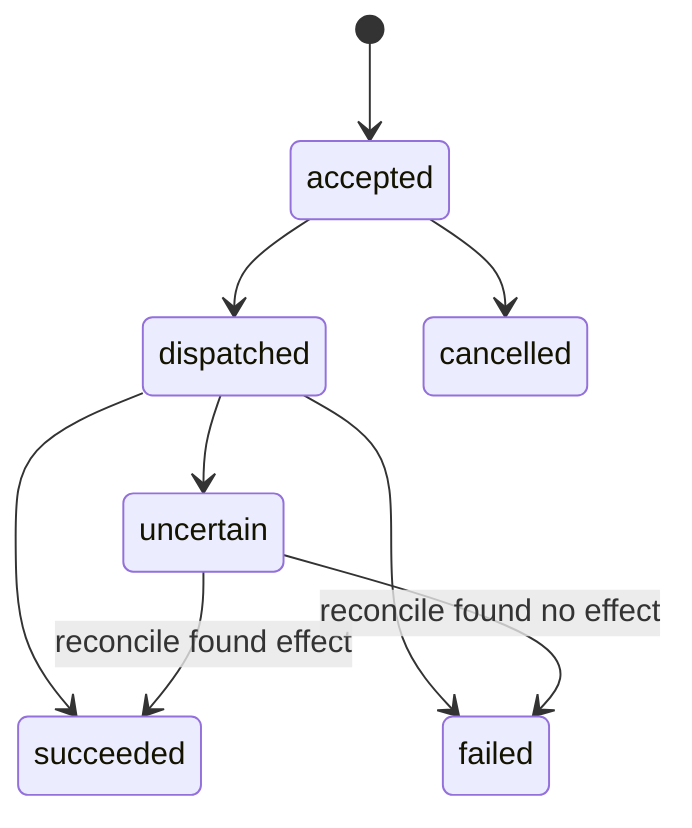

# 命令模型

所有修改操作都是异步命令。Control API 验证请求并持久化后返回：

```http
HTTP/1.1 202 Accepted
Location: /api/v1/commands/2e2ce1ac-2604-4bc7-9f9d-929ac2acd98a
```

```json
{
  "commandId": "2e2ce1ac-2604-4bc7-9f9d-929ac2acd98a",
  "state": "accepted",
  "createdAt": "2026-07-10T12:00:00Z",
  "completedAt": null,
  "result": null,
  "error": null,
  "statusUrl": "/api/v1/commands/2e2ce1ac-2604-4bc7-9f9d-929ac2acd98a"
}
```

## 状态机



`uncertain` 表示游戏可能已经完成操作，但 Control API 未收到可靠 ACK。这时必须读取最新 revision 并对账，不能自动重发。

公告的每个渠道也遵守这一规则：调用官方 REST 或 Native Bridge 前先持久化 `channel-dispatched`；若发送后超时、连接中断或服务重启，该渠道进入 `uncertain`。由于公告没有可靠的事后查询/撤回能力，操作者必须先在游戏内确认，系统不会自动重发。

## 幂等

请求必须有 `Idempotency-Key`：

- 相同 key + 相同规范化 payload：返回第一次命令与结果。
- 相同 key + 不同 payload：`409 IDEMPOTENCY_KEY_REUSED`。
- 服务端保存 `requestHash`，并在 Bridge envelope 中继续传递。

公告命令把事件追加到 `data/command-audit.jsonl`，草稿事件追加到 `data/announcement-events.jsonl`。事件在调用任何传输前强制刷新到磁盘；服务重启时从事件日志恢复幂等索引、命令状态和逐渠道状态。审计可通过 `GET /api/v1/audit/commands` 查询。

## 公告发布

当前开放 `audience.type=global`，渠道可选 `chat`（官方 REST）、`client-overlay`（Native Bridge + Palworld server notice）或两者。API 在入队前按渠道校验能力；`publishAt` 是未来时间时，单消费者队列会在到期后再次 fail-closed 检查传输能力并派发。

命令结果的 `result.channels` 逐项返回 `channel`、`state`、可选 HTTP 状态、客户端数量和错误。只有所有渠道都成功时公告才进入 `published`；全部明确失败时命令为 `failed`，部分成功或任一渠道结果不确定时命令为 `uncertain`，从而阻止盲目整体重试。

## 乐观并发

读取背包/帕鲁列表会返回 `revision` 和 ETag。修改请求同时提交 `If-Match` 与 `expectedRevision`；不一致时返回 `412 REVISION_MISMATCH`，UI 强制重新加载并展示 diff。

## 背包事务示例

```http
POST /api/v1/servers/local/players/steam-123/inventory/transactions
Idempotency-Key: inv-20260710-001
If-Match: "inventory:48"
Content-Type: application/json
```

```json
{
  "expectedRevision": 48,
  "reason": "补偿活动奖励",
  "dryRun": true,
  "operations": [
    {
      "type": "grant",
      "itemId": "CopperIngot",
      "quantity": 20,
      "slotId": null,
      "durability": null
    }
  ]
}
```

UI 默认先发 `dryRun=true`，显示容量、stack 合并与 before/after，再由有权限的操作者确认提交。

## 统一错误码

```text
BRIDGE_UNAVAILABLE
UNSUPPORTED_GAME_BUILD
CAPABILITY_DISABLED
PLAYER_OFFLINE
PLAYER_SESSION_CHANGED
REVISION_MISMATCH
IDEMPOTENCY_KEY_REUSED
INVALID_ITEM_ID
STACK_LIMIT_EXCEEDED
INVENTORY_FULL
PAL_NOT_BOXED
PAL_INSTANCE_CHANGED
COMMAND_EXPIRED
BRIDGE_BACKPRESSURE
COMMAND_OUTCOME_UNCERTAIN
```
