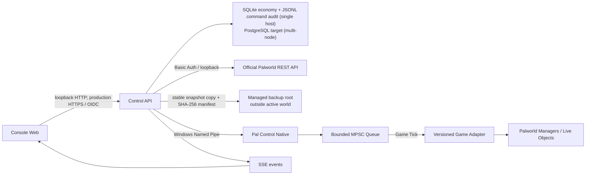

# 总体架构

## 组件关系



浏览器不直接连接官方 REST、RCON 或模组。当前单机版本只监听 loopback：经济账本使用本地 SQLite 事务事件库，游戏命令以独占 lease 加 JSONL 事件日志实现幂等队列和审计；它不是公网入口。未来开放非本机访问时，必须先增加 HTTPS 反向代理、身份认证、权限和限流，并把状态存储迁移到 PostgreSQL 等支持多实例并发的数据库。

## 目录职责

```text
pal-control/
├─ apps/
│  └─ console-web/              React 网页控制台
│     └─ src/
│        ├─ app/                路由、布局、样式
│        ├─ features/           玩家、公告、背包、帕鲁等垂直功能
│        └─ lib/api/            生成的 SDK、SSE、错误处理
├─ services/
│  └─ control-api/              唯一对外 API
│     ├─ Domain/                命令与领域模型
│     ├─ Infrastructure/        官方 REST、bridge、数据库适配器
│     └─ Contracts/             HTTP 端点映射
├─ mods/
│  └─ pal-control-native/       Windows 服务端模组
│     ├─ Config/                bridge 和 fail-closed 开关
│     └─ Source/PalControl/
│        ├─ Public/Contracts/   纯 DTO，不含 Unreal 指针
│        ├─ Public/GameAdapter/ 按游戏版本实现的接口
│        └─ Private/Bridge/     Named Pipe、队列、dispatcher
├─ packages/
│  └─ contracts/
│     ├─ openapi/               Browser <-> Control API
│     └─ bridge/                Control API <-> Native Mod
├─ deploy/windows/              配置示例和安装脚本
├─ docs/                        架构、API、运行手册
└─ tests/
   ├─ contract/                 OpenAPI/JSON Schema 契约测试
   └─ integration/              fake bridge 与 REST 适配测试
```

后续功能按垂直切片放到 `features`/`Domain`/`Infrastructure` 对应目录，不要做一个无限增长的 `controllers` 或 `utils` 目录。

## 数据通道

### 官方 REST 通道

适合：服务端信息、在线玩家摘要、设置、公告、kick/ban、保存、关服和指标。它只监听 loopback 或可信 LAN，凭据保存在服务器 Secret Store 中。

### Native Bridge 通道

适合：官方 REST 未提供的背包、PalBox、帕鲁实例及受控写操作。Bridge 仅接收领域命令，不能暴露任意反射、任意函数调用、内存读写或原始存档字段。

### Offline Maintenance 通道

只用于明确停服后的存档迁移/修复：停止服务、完整备份、版本校验、临时文件写入、原子替换、启动验证、失败回滚。它与在线模组命令必须是不同模块和不同权限。

在线存档中心不属于 Offline Maintenance：它只能请求官方保存、观察游戏产生的新稳定快照、复制到独立备份根目录并校验 SHA-256。恢复、删除、上传和原始 SaveGame 修改继续保持未开放。

## 玩家数据模型

- `playerId`：控制面稳定 ID。
- `uid`：游戏暴露的玩家 UID，仅作为外部标识。
- `sessionId`：每次在线会话，写命令必须匹配。
- `revision`：背包或 Pal 集合版本，读取时返回 ETag，写入时使用 `If-Match`。
- `instanceId`：帕鲁稳定实例 ID；禁止用列表索引定位。

首版不允许修改帕鲁 species、owner、instanceId、原始 SaveGame 字段。允许项从昵称、受限等级、被动技能白名单开始，且默认要求 Pal 位于 Box 中。

## 版本兼容

每个游戏版本通过 `IGameAdapter` 隔离。Bridge 启动时探测关键类、函数、字段与目录：

1. 协议版本不兼容：拒绝连接。
2. 未识别 game build：只读安全模式。
3. 任一写操作依赖探针失败：仅关闭该 capability。
4. UI 只根据 `/capabilities` 显示按钮，不自行猜测能力。

所有错误均 fail closed。游戏更新后的默认行为是隐藏写操作，而不是继续调用旧地址或旧字段。

## 安全和审计

建议角色：Viewer、Moderator、GameMaster、Administrator、Owner。权限应细分为 `inventory.grant`、`inventory.remove`、`pal.edit.nickname`、`pal.edit.stats`、`announcement.publish`、`server.shutdown`。

审计记录至少包含：操作者/角色/IP、理由、commandId、idempotencyKey、requestHash、目标玩家/帕鲁、before/after diff、游戏/模组/适配器版本、结果、错误、时间和前后 revision。日志应 append-only，并对批量发放、关服等高风险操作启用 MFA 或双人审批。
