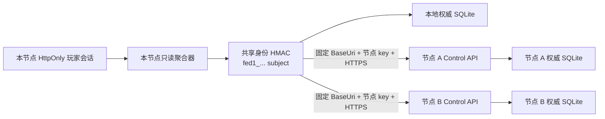

# 多服务器只读聚合与兼容矩阵运行手册

## 产品边界

Federation 只解决三件事：登记多个 Palworld 服务器、从同一平台身份读取各节点自己的账户/周档/双币摘要，以及用精确兼容矩阵阻断未知运行组合。每个 Palworld 服务器仍由一个本地 Control API 和本地 SQLite 权威库拥有全部写操作。

以下能力明确不在范围内：跨服交易、钱包转移、跨服库存、拍卖、从聚合器代发商品、把一个节点的周战备券带到另一个节点。节点失败时页面必须显示 `unavailable`，版本或矩阵漂移时显示 `incompatible`，两者都不能伪装成 0 余额。

当前仓库没有任何 `stable` 组合：

- `v1.0.0.100427` + UE4SS `c2ac246447a8bcd92541070cb474044e7a2bbbe6` + Native `0.3.0-dev.36` 是 `experimental`；Steam build 未精确固定，`inventory.consume.experimental` 也没有通过真实持久化门禁。
- 当前观察到的 `v1.0.1.100619` / Steam build `24181105` 是 `quarantined`；旧 loader 已被隔离，Bridge 不可用。磁盘 DLL digest 一致不等于新进程兼容，禁止直接恢复旧 loader。

因此，代码和自动化可以完成多节点模拟验收，但现在不能宣称生产多服已经验收。

## 信任边界



原始 Steam/UserId、PlayerUID、accountId、玩家 Cookie 和 HMAC subject 都不会出现在聚合响应或审计数据中。聚合请求的目标 URL 只能来自启动配置；玩家不能通过 query、body 或 header 覆盖身份或节点 URL。远端节点遍历自己的权威账户，重新计算 HMAC 后做固定时序比较，再只读 `active season + GetWallet`；它不会创建账户、初始化余额或维护第二份可写钱包。

节点间 key 只用于 `/api/v1/internal/federation/*`。身份 HMAC key 与节点认证 key 必须不同。生产配置应只引用 ACL 受限的 secret file 或环境变量，不要把明文写进 JSON、命令行、日志或截图。

当前模型只适用于**同一运营方、同一安全信任域**的节点：所有节点共享身份 HMAC，接收端当前只有一个 inbound key。它不提供第三方运营者之间的零信任隔离；任一受信节点失陷都必须按整个 federation 身份域事故处置。不得把陌生社区或外部组织节点加入同一注册。

在解除生产门禁前还必须补齐两项协议加固：接收端需验证调用方声明的精确 compatibility combination（而不只由调用方事后校验响应），并为共享身份 key 增加非秘密 `IdentityKeyId`/轮换版本握手。否则过期节点可能仍读取摘要，或身份 key 配错时把故障静默表现为“本服无账户”。当前没有 stable 组合且 `Federation.Enabled=false`，所以这些缺口不会影响单服方案 A，但也意味着不能提前启用生产 federation。

## 兼容矩阵

权威文件：

- `services/control-api/Compatibility/compatibility-matrix.v1.json`
- `services/control-api/Compatibility/compatibility-matrix.v1.schema.json`

根属性 `canonicalSha256` 是移除该属性后，对所有对象 key 做 ordinal 排序、移除非语义空白所得 JSON 的 SHA-256。数组顺序属于语义；组合和 capability 还必须排序且唯一。验证器拒绝：

- 模糊版本（`latest`、通配符、短 UE4SS commit）；
- 重复 id 或重复版本元组；
- 缺失/未知字段、额外字段和不合法 artifact hash；
- canonical hash 或部署 pin 不一致；
- `unknown`、Bridge unavailable、开发版或实验 capability 被标记为 `stable`；
- 生产节点引用 `experimental`/`quarantined` 组合。

只读校验：

```powershell
dotnet run --project .\tools\compatibility-guard\PalControl.CompatibilityGuard.csproj `
  --configuration Release -- `
  --matrix .\services\control-api\Compatibility\compatibility-matrix.v1.json `
  --combination pal-1.0.0.100427-native-dev36
```

生产门禁必须增加 `--expected-sha256` 和 `--require-stable`，并传入实际探针值：

```powershell
.\deploy\windows\Test-CompatibilityMatrix.ps1 `
  -MatrixPath C:\ProgramData\PalControl\compatibility-matrix.v1.json `
  -CombinationId REVIEWED_STABLE_ID `
  -ExpectedSha256 REVIEWED_64_HEX_DIGEST `
  -RequireStable `
  -GameVersion vX.Y.Z.BUILD `
  -SteamBuild NUMERIC_BUILD_ID `
  -PalDefenderVersion X.Y.Z `
  -Ue4ssCommit FULL_40_HEX_COMMIT `
  -NativeProtocol 1.0 `
  -NativeMod X.Y.Z `
  -BridgeAvailability available
```

任何字段不匹配都必须停止部署或启动。不要在脚本外“临时跳过”门禁。

## 节点配置

生产示例位于 `deploy/windows/appsettings.Production.example.json`。启用前至少完成：

1. 为所有节点部署完全相同、已签审的矩阵文件，并设置 `ExpectedMatrixSha256`。
2. 使用相同的高熵身份 HMAC key，使相同平台身份在各节点得到同一不可逆 subject；每个节点通过受限文件读取。
3. 为每条出站边设置节点认证 key；接收端设置对应 inbound key。身份 key 不能复用为认证 key。
4. `BaseUri` 与 `PortalUrl` 在生产必须是 HTTPS，无 credentials/query/fragment；`BaseUri` 只能是 origin 根路径。
5. 每台机器恰好一个 `Local=true` 节点，其 `ServerId` 必须同时等于 `Federation:LocalServerId` 和 `ExtractionMode:ServerId`。
6. 所有生产组合必须是矩阵中的 `stable`。当前仓库没有 stable 组合，所以当前配置即使改为 `Enabled=true` 也应启动失败。

Development 只有在 `AllowExperimentalInDevelopment=true` 时才允许本地 experimental 组合。HTTP 只允许 Development 回环地址；它不是生产 TLS 的替代品。quarantined 组合始终投影为 incompatible。

关键边界默认值：2 秒节点超时、32 KiB 最大响应、2 KiB 内部请求、8 路全局并发、每来源每分钟 600 次内部只读请求。重定向被关闭，3xx 会作为 `FEDERATION_REDIRECT_REJECTED` 处理。

## API 与页面接入

- `POST /api/v1/internal/federation/profile`：节点 key 认证、限流、严格 `fed1_` token，返回本节点只读 profile。
- `GET /api/v1/internal/federation/health`：节点 key 认证，返回本节点 serverId 和兼容身份。
- `GET /api/v1/player/me/federation`：只从玩家 session 派生身份，返回每节点显式状态、展示名、周档与双币摘要。
- `GET /api/v1/admin/federation/health`：Viewer 节点注册/健康视图。
- `GET /api/v1/admin/federation/compatibility-matrix`：Viewer 查看 canonical digest、组合、证据和引用节点。

服务器切换只能使用响应中的 allowlisted `portalUrl`。前端必须用普通跨源导航并设置 `noopener noreferrer`，不得在 URL、header、localStorage 或 `postMessage` 中携带本地 Cookie、CSRF、节点 key 或 federation subject。目标站点重新执行自己的 Steam + 游戏内验证码登录。

## 轮换与事故处置

身份 HMAC key 轮换会改变所有 subject，必须作为有计划的全节点一致变更：暂停 federation 读取、同时部署新 key、重启所有 Control API、用同一测试身份核对所有节点，再恢复读取。不要同时保留可由浏览器选择的旧/新 subject。

节点认证 key 可以逐边轮换：先在维护窗口更新接收端和调用端 secret file，再重启双方并用 internal health 验证。当前实现不会热重载 secret file；文件变化后必须受控重启。错误响应、日志和工单不得粘贴 key 或 subject。

出现以下任一情况时，从聚合注册中隔离该节点并保留其他节点读取：matrix hash/combination/serverId 不一致、3xx、认证拒绝、超时、响应超限、JSON 不符合契约、quarantined 状态。余额不能从其他节点复制回填。

## 自动化证据与外部门禁

```powershell
dotnet build .\tests\federation\PalControl.Federation.Harness.csproj -c Release
.\tests\integration\federation-smoke.ps1
npm run lint:openapi
```

harness 使用 3 个临时 SQLite 节点和 100 个合成账户，覆盖同身份一致、不同身份隔离、节点独立周档/永久币/周券、20 次只读重放、重启、节点掉线、矩阵漂移、错误 key/token、SSRF 配置、重定向、超限、超时和并发上限。HTTP smoke 启动真实 Control API 进程，但只使用回环端口和临时数据，不连接或修改真实 PalServer。

仍需人工/外部完成且当前不能勾成生产完成：接收端调用方 combination 校验与 `IdentityKeyId` 握手；按 peer 独立吊销的 inbound 认证设计；真实第二和第三 Palworld 服务器；正式域名与双向受控 TLS 网络；生产 secret ACL、备份与轮换演练；每个节点精确版本探针和 stable 兼容验收；真实玩家在各服独立建号、换周和故障恢复验证。单个 Control API/worker 的多实例数据库迁移仍属于 P1-07，不由 federation 代替。
