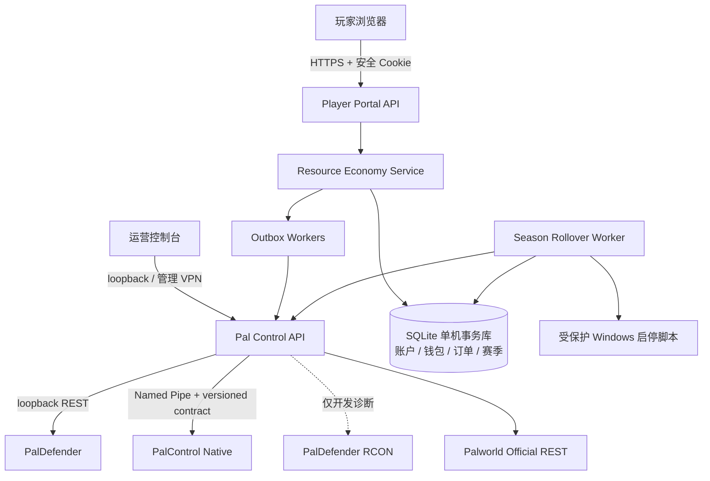

# 00：MVP 玩法与架构

## 0. 基线与资料来源

本文基线日期为 2026-07-15，并按 [ADR-0001：采用周世界资源经济服](../../docs/architecture/decisions/0001-weekly-world-resource-economy.md) 更新产品定位。能力判断优先级为：当前仓库代码与运行探针 > 当前仓库运行手册 > 上游版本化文档 > 设计假设。PalDefender 是第三方服务端插件，并非 Pocketpair 官方组件；它的端点以 [PalDefender REST API](https://ultimeit.github.io/PalDefender/zh/RESTAPI/)、[`/delitems` 与 `/clearinv` 命令文档](https://ultimeit.github.io/PalDefender/Commands/) 和仓库内 [PalDefender 集成运行手册](../../docs/runbooks/paldefender-integration.md) 为维护入口。Pal Control 的安全边界与命令语义见 [总体架构](../../docs/architecture/overview.md)、[命令模型](../../docs/api/command-model.md) 和 [存档中心运行手册](../../docs/runbooks/save-management.md)。

本文把“现有能力”和“目标能力”明确分开。出现 `尚未实现`、`新增` 或 `上线硬门槛` 的项目，不能仅凭本文档视为可用；必须通过 [实施阶段与验收](05-实施阶段与验收.md) 中的当前环境证据。

## 1. 产品决策

### 1.1 节奏

正式服采用：

- 周档：周一 `04:00` 至下周一 `03:30`，最后 30 分钟为结算维护期。
- 日刷新：每天 `04:00`，刷新营业日内容、商城报价、日任务和热点区域；个人周限购只在新周档重置。
- 世界：每周创建全新 Palworld 世界，旧世界只归档、不在线覆盖。
- 永久层：账户、商域币、订单历史、违规记录和赛季成绩保存在数据库。
- 周期层：PlayerUID、战备券、周限购、资源兑换统计和当前世界数据随周档重置。

不选每日删档的原因：玩家无法形成稳定的周目标，购买物资寿命过短，换档故障面扩大七倍。每日变化由轮换和任务完成，不需要删除世界。

### 1.2 资源经济循环

1. 玩家以 Steam 平台账户登录网页。
2. 系统把平台 `UserId` 与当前世界 `PlayerUID` 绑定。
3. 玩家读取当前不可变内容版本，用商域币或战备券购买当周物资；提交必须携带匹配的版本 ID、hash 和 SKU。
4. PalDefender 把物资发入当前在线角色的背包。
5. 玩家在常驻周世界中自由采集、战斗、生产、交易和积累资源。
6. 玩家携带任意来源的白名单资源进入指定资源兑换区，在网页申请整单报价。
7. 服务端确认玩家位置和完整背包快照，通过 Native Bridge 的稳定 `inventory.consume` 能力在游戏线程内校验并回收报价中的全部合格资源。
8. Native 返回数量、完整槽位前后快照、会话与持久化验收均通过后，数据库才增加战备券；可靠日/周任务只按这些已持久化经济终态推进并唯一发奖。


### 1.3 货币

| 货币 | 范围 | 主要来源 | 主要用途 |
| --- | --- | --- | --- |
| 商域币 `market_credit` | 永久 | 当前 3 个日任务、3 个周任务、管理员补偿和显式初始化；排名奖励尚未实现 | 基础战备商品 |
| 战备券 `supply_ticket` | 当前周档 | 成功出售白名单资源、管理员补偿和显式初始化；当前任务不产出战备券 | 当周武器消耗品、弹药、药品和补给 |

所有金额都是整数 `BIGINT`，不使用浮点数。商品买价与资源回收价分别配置，目录外 ItemID 默认不可售。发布校验会穷尽显式 attested 的运营经济影子 DAG：真实礼包数量、至少一层影子转换、双币率、转换费用、资源结算取整、最高热点倍率、逐 ItemID 参考成本和类别风险缓冲都进入判断；图环、缺数据和状态上限 fail closed。该影子图明确不是 Palworld 实际配方数据库，也不覆盖玩家私下交易，不能宣称消除了模型外套利。详见 [经济平衡与反套利保护](../../docs/economy-balance-guard.md)。

### 1.4 MVP 范围

MVP 包含：

- 单台 Palworld 服务器、单一当前周档。
- 在线玩家身份绑定、钱包、账本、版本化每日商城和显式个人/全服库存。
- 10 个目录过滤商品候选、51 个目录过滤可售资源候选，以及只接受权威经济终态的 3 日/3 周任务。
- 物品商城发货。
- 圆形资源兑换区、网页发起、整单资源兑换结算。
- 日刷新和受控周换档。
- 管理员审计、人工对账和全局熔断开关。

MVP 不包含：

- 每局启动独立实例、排队匹配或跨服传送。
- 离线发货、离线资源兑换或在线直接修改 `.sav`。
- 帕鲁、武器、护甲、关键物品的资源兑换。
- 逐局行动生命周期、战利品来源归因、死亡结算和行动成功率。
- 玩家间拍卖、交易市场、现金充值或退款支付通道。
- 客户端自定义 UI；首版使用独立网页。

## 2. 现有能力的正确用法

### 2.1 可以直接复用

- PalDefender `GET players`：在线状态、平台 `UserId`、本周 `PlayerUID` 和地图位置。
- PalDefender `GET items/{playerIdentifier}`：`Items`、`KeyItems`、`Weapons`、`Armor`、`Food`、`DropSlot` 六类容器。
- PalDefender `POST give/items/{playerIdentifier}`：向在线玩家发物品。
- Pal Control SQLite PalDefender outbox：`Idempotency-Key`、`accepted -> dispatched -> succeeded/failed/uncertain`、租约、dead-letter、重启恢复和不可变审计事件。
- 官方 REST 与存档中心：公告、保存、稳定快照和 SHA-256 校验。
- Native Bridge：已实现游戏线程上的完整槽位快照、revision 校验、整单预检、安全清空普通静态资源槽位和写后回读；动态、腐坏中或元数据不可证明的槽位在写入前整单拒绝。
- PalDefender RCON `/send`：只在本机受限通道向在线角色发送登录验证码；`/delitems` 与 `/clearinv` 仅保留为开发诊断或经批准的人工应急能力，不参与正式资源兑换。

### 2.2 不能误判为现成能力

- `POST give/items` 只能发放，不能回收资源兑换物品。
- 旧 dev36 开发版曾实现 experimental 扣物语义；dev37-ro 因把持久离线库存误当作 live inventory 已被隔离。dev38-ro 曾受控完成 9 项非玩家成功、玩家/成长/库存 3 项因无人在线拒绝、0 项意外失败，但现已 `superseded/quarantined`。当前 dev39-ro 是只完成 893,440 字节双独立可复现构建的 `quarantined` 只读源码/制品候选，尚未实服加载或运行固定套件，且完全不声明 consume/write capability。只有 dev39-ro 固定套件、在线玩家三项、PalDefender 组合和独立复核通过、另行评审写候选并完成真实玩家“扣物 → 保存 → 停服 → 重启 → 重登”验收后，才可考虑打开生产资源兑换闸门。
- Native 不能验证全部请求槽位、实际扣除数量不等于请求、回读不完整、持久化证据缺失或连接结果不确定时，一律不入账且不自动重扣。
- 存档中心只保存和备份，不会自动创建/切换新世界。
- 当前已实现 Steam OpenID 与游戏内验证码双层绑定、HttpOnly Cookie、CSRF、Origin/限流和当前周 PlayerUID 绑定；Production/PublicSteam 强制官方 HTTPS OP 与精确 realm/return_to，但仍需在正式域名完成 TLS、代理回调、Cookie 和重放黑盒验收。
- 当前已实现 SQLite 内容草稿、规范 hash、diff、严格依赖校验、不可变版本、current pointer、发布/回滚和旧 offer 拒绝；内置 10 个商品与 51 个资源候选均按本机授权目录过滤。current pointer 与完整商品投影在同一事务激活，第 N 个商品注入故障、重启重试、20 次激活和回滚均已自动通过。
- 当前已实现 3 个日任务与 3 个周任务的持久实例、权威事件哈希、钱包/积分唯一奖励和恢复 worker；击杀、采集、进入热点、死亡和 PvP 未开放。
- HTTP `202` 只表示持久接收；HTTP `200` 命令查询也必须结合命令状态判断，不能视为游戏操作一定完成。

## 3. 目标组件



职责边界：

- Player Portal：登录、CSRF、防刷、仅访问自己的钱包/订单/资源兑换。
- Economy Service：价格、限购、账本事务、状态机和对账；不保存上游 token。
- Pal Control：唯一游戏控制入口；生产 consume 只调用版本锁定、能力探针通过的 Native 结构化契约，不接受任意命令字符串。
- PalDefender REST：读玩家/背包和发放物品。
- PalDefender RCON：本机受限 `/send` 是游戏内验证码通道；其他白名单命令只用于开发诊断/人工应急，不进入生产资源兑换路径。
- Native MOD：在游戏 Tick 内完成完整预检、扣除和回读；API 与账本状态机保留幂等/不确定语义，禁止暴露任意反射或任意函数调用。
- SQLite：当前单实例经济事实来源；游戏存档不是永久钱包来源。只有转为多 Control API/worker 实例时才迁移至 PostgreSQL 等支持多节点锁与 lease 的存储。

## 4. 玩家身份

内部主键使用随机 UUID `account_id`。身份链如下：

```text
account_id
  -> platform_identity(provider=steam, subject=steam_7656...)
  -> season_player(season_id, world_guid, player_uid)
```

规则：

1. `UserId` 是跨周档身份。入库前统一小写、去除首尾空格，并验证平台前缀与格式。
2. `PlayerUID` 只在 `world_guid` 内唯一。新世界必须重新建立映射。
3. 玩家显示名可更改且可能重名，只用于展示和审计，不参与授权、钱包或发货。
4. Steam 网页登录得到 Steam64 ID 后转换为规范 `steam_<steam64>`；首次绑定必须同时在 PalDefender 在线玩家结果中找到完全相同的 `UserId`。
5. 非 Steam 平台留到后续，以游戏内一次性验证码绑定；不能让运营人员仅凭昵称手工合并钱包。
6. 一个当前世界的 `PlayerUID` 只能绑定一个账户，一个平台身份也只能属于一个账户。

## 5. 资源兑换区与报价

MVP 使用内容版本中的圆形区域：`map_x`、`map_y`、`radius`、路线、风险提示、开放时段、grace 和收益倍率。当前本地内容有 2 个全天候选开发区，每个业务日确定性选择 1 个热点并由服务端把热点倍率计入报价；候选点 2 明确待真实 Palworld 校准。新报价从 closing instant 起关闭，已有报价只可在自身 30 秒有效期和窗口 `graceSeconds` 的交集内完成；所有点关闭时返回最早下一开放时间。玩家请求报价时：

- PalDefender 必须在线、版本符合固定组合。
- 玩家必须连续两次位置采样均在同一资源兑换区内，两次间隔至少 2 秒。
- 当前世界必须等于数据库打开的赛季 `world_guid`。
- 同一玩家只能有一个未终结资源兑换 settlement，且不得有未对账的商城发货。
- 报价只读取 `Items`、`Food`、`DropSlot`；每行记录容器 ID、槽位、ItemID、数量、单价和总价。
- 报价有效期 30 秒，并包含扫描时所有合格资源的全部数量。玩家可取消整单，但首发不能选择部分出售；确认时必须再次读取 revision/快照哈希，任何变化都要求重新报价。

装备和关键物品不会进入报价，也不会被扣除。物品目录外条目默认 `sellable=false`、价格为 0，保持 fail closed。

## 6. 安全原则

- 当前 Control API、PalDefender `17993`、官方 REST 和 Named Pipe 均不暴露公网。
- RCON 即使为诊断而启用，`25575` 也必须阻断所有远程入站且绝不做端口映射；`AdminPassword` 必须交给仅服务账户可读的 Secret Store 并定期轮换。
- 玩家门户与运营控制台使用不同监听地址、不同认证和不同权限。
- 玩家门户要求 HTTPS、`HttpOnly + Secure + SameSite=Lax` Cookie、CSRF token、登录与购买限流。
- 商品价格、玩家 ID、余额、资源兑换价值全部由服务端计算；商城客户端只回传服务端给出的 `productId + contentVersionId + contentHash + SKU + quantity`，资源兑换只提交 quote/run ID，不能自定义价格、ItemID 或回收明细。
- 所有游戏写操作在调用前持久化，调用后按状态机终结。
- `uncertain` 不自动退款、不自动重发、不自动入账，进入人工或只读自动对账。
- 网页不提交 ItemID、数量或槽位明细；服务端只从冻结的白名单报价构造 Native consume 请求，禁止按昵称定位玩家。
- 版本、世界身份、玩家在线会话、位置、Native 稳定能力、完整快照或持久化证据任一不匹配，资源兑换写入关闭。
- 高风险人工调整必须填写原因并产生不可变账本条目，禁止直接 `UPDATE wallets.balance`。
