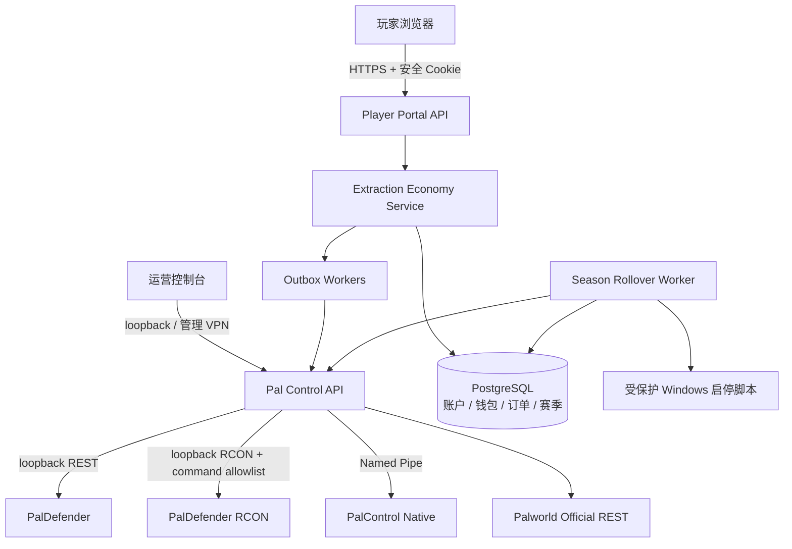

# 00：MVP 玩法与架构

## 0. 基线与资料来源

本文基线日期为 2026-07-12。能力判断优先级为：当前仓库代码与运行探针 > 当前仓库运行手册 > 上游版本化文档 > 设计假设。PalDefender 是第三方服务端插件，并非 Pocketpair 官方组件；它的端点以 [PalDefender REST API](https://ultimeit.github.io/PalDefender/zh/RESTAPI/)、[`/delitems` 与 `/clearinv` 命令文档](https://ultimeit.github.io/PalDefender/Commands/) 和仓库内 [PalDefender 集成运行手册](../../docs/runbooks/paldefender-integration.md) 为维护入口。Pal Control 的安全边界与命令语义见 [总体架构](../../docs/architecture/overview.md)、[命令模型](../../docs/api/command-model.md) 和 [存档中心运行手册](../../docs/runbooks/save-management.md)。

本文把“现有能力”和“目标能力”明确分开。出现 `尚未实现`、`新增` 或 `上线硬门槛` 的项目，不能仅凭本文档视为可用；必须通过 [实施阶段与验收](05-实施阶段与验收.md) 中的当前环境证据。

## 1. 产品决策

### 1.1 节奏

正式服采用：

- 周档：周一 `04:00` 至下周一 `03:30`，最后 30 分钟为结算维护期。
- 日刷新：每天 `04:00`，刷新商城报价、限购、日任务和热点区域。
- 世界：每周创建全新 Palworld 世界，旧世界只归档、不在线覆盖。
- 永久层：账户、商域币、订单历史、违规记录和赛季成绩保存在数据库。
- 周期层：PlayerUID、战备券、周限购、撤离统计和当前世界数据随周档重置。

不选每日删档的原因：玩家无法形成稳定的周目标，购买物资寿命过短，换档故障面扩大七倍。每日变化由轮换和任务完成，不需要删除世界。

### 1.2 一次游戏循环

1. 玩家以 Steam 平台账户登录网页。
2. 系统把平台 `UserId` 与当前世界 `PlayerUID` 绑定。
3. 玩家用商域币或战备券购买当周物资。
4. PalDefender 把物资发入当前在线角色的背包。
5. 玩家在世界中搜索、战斗、拾取资源并承担死亡掉落风险。
6. 玩家携带战利品进入指定撤离区，在网页申请撤离报价。
7. 服务端确认玩家位置和背包快照，以白名单 RCON `/delitems` 回收可结算战利品。
8. REST 后快照证明目标数量确实消失后，数据库增加战备券；周任务和赛季结算可发放少量商域币。


### 1.3 货币

| 货币 | 范围 | 主要来源 | 主要用途 |
| --- | --- | --- | --- |
| 商域币 `market_credit` | 永久 | 周任务、周排名、运营补偿；不直接按全部战利品价值大量产出 | 基础战备、保险类服务、永久限购 |
| 战备券 `supply_ticket` | 当前周档 | 成功撤离出售战利品、日任务 | 当周武器消耗品、弹药、药品和补给 |

所有金额都是整数 `BIGINT`，不使用浮点数。商品买价与撤离卖价分别配置；默认卖价不得高于同物品最低买价的 50%，避免“商城买入再撤离卖出”套利。可设置 `sellable=false` 完全禁止回收。

### 1.4 MVP 范围

MVP 包含：

- 单台 Palworld 服务器、单一当前周档。
- 在线玩家身份绑定、钱包、账本、每日轮换商城。
- 物品商城发货。
- 圆形撤离区、网页发起、物品撤离结算。
- 日刷新和受控周换档。
- 管理员审计、人工对账和全局熔断开关。

MVP 不包含：

- 每局启动独立实例、排队匹配或跨服传送。
- 离线发货、离线撤离或在线直接修改 `.sav`。
- 帕鲁、武器、护甲、关键物品的撤离销售。
- 玩家间拍卖、交易市场、现金充值或退款支付通道。
- 客户端自定义 UI；首版使用独立网页。

## 2. 现有能力的正确用法

### 2.1 可以直接复用

- PalDefender `GET players`：在线状态、平台 `UserId`、本周 `PlayerUID` 和地图位置。
- PalDefender `GET items/{playerIdentifier}`：`Items`、`KeyItems`、`Weapons`、`Armor`、`Food`、`DropSlot` 六类容器。
- PalDefender `POST give/items/{playerIdentifier}`：向在线玩家发物品。
- PalDefender RCON `/delitems <UserId> ItemId:Amount...`：按平台 UserId 定向删除物品；MVP 通过新建的受限本机适配器调用。
- PalDefender RCON `/clearinv`：可以清空背包，但范围过大，只保留给开发服或人工应急，不进入自动撤离流程。
- Pal Control PalDefender 命令队列：`Idempotency-Key`、`accepted -> dispatched -> succeeded/failed/uncertain`、重启恢复和审计。
- 官方 REST 与存档中心：公告、保存、稳定快照和 SHA-256 校验。
- Native Bridge：游戏线程上的精细背包读写与 revision 校验机制，可作为未来更强的精确槽位消费后端。

### 2.2 不能误判为现成能力

- `POST give/items` 只能发放，不能回收撤离物品。
- RCON 文本响应没有结构化 revision、事务和幂等 ACK；发送中断后不能判断命令是否执行，必须进入 `uncertain`，禁止重发。
- `/delitems` 不是跨 ItemID 原子事务；REST 后快照出现部分删除时必须人工对账，不能按比例自动入账。
- 当前 Native 背包修改不允许数量归零，也不覆盖全部容器，因此首版不把它当作撤离扣物后端。
- 存档中心只保存和备份，不会自动创建/切换新世界。
- 当前 Control API 没有玩家公网认证，不能直接暴露为商城后端。
- HTTP `202` 只表示持久接收；HTTP `200` 命令查询也必须结合命令状态判断，不能视为游戏操作一定完成。

## 3. 目标组件



职责边界：

- Player Portal：登录、CSRF、防刷、仅访问自己的钱包/订单/撤离。
- Economy Service：价格、限购、账本事务、状态机和对账；不保存上游 token。
- Pal Control：唯一游戏控制入口，继续保持本机监听；RCON 适配器只接受结构化 consume DTO，不接受任意命令字符串。
- PalDefender REST：读玩家/背包和发放物品。
- PalDefender RCON：MVP 仅允许 `/delitems`；`/clearinv` 不进入自动白名单。
- Native MOD：长期可实现 `inventory.consume` 替换 RCON 后端，API 与账本状态机不变；禁止暴露任意反射或任意函数调用。
- PostgreSQL：经济事实来源；游戏存档不是永久钱包来源。

## 4. 玩家身份

内部主键使用随机 UUID `account_id`。身份链如下：

```text
account_id
  -> platform_identity(provider=steam, subject=steam_7656...)
  -> season_player(season_id, world_guid, player_uid)
```

规则：

1. `UserId` 是跨周档身份。入库前统一小写、去除首尾空格，并验证平台前缀与格式。
2. `PlayerUID` 只在 `world_guid` 内唯一。新世界必须重新建立映射。
3. 玩家显示名可更改且可能重名，只用于展示和审计，不参与授权、钱包或发货。
4. Steam 网页登录得到 Steam64 ID 后转换为规范 `steam_<steam64>`；首次绑定必须同时在 PalDefender 在线玩家结果中找到完全相同的 `UserId`。
5. 非 Steam 平台留到后续，以游戏内一次性验证码绑定；不能让运营人员仅凭昵称手工合并钱包。
6. 一个当前世界的 `PlayerUID` 只能绑定一个账户，一个平台身份也只能属于一个账户。

## 5. 撤离区与报价

MVP 使用配置化圆形区域：`map_x`、`map_y`、`radius`、开放时段。玩家请求报价时：

- PalDefender 必须在线、版本符合固定组合。
- 玩家必须连续两次位置采样均在同一撤离区内，两次间隔至少 2 秒。
- 当前世界必须等于数据库打开的赛季 `world_guid`。
- 同一玩家只能有一个未终结撤离，且不得有未对账的商城发货。
- 报价只读取 `Items`、`Food`、`DropSlot`；每行记录容器 ID、槽位、ItemID、数量、单价和总价。
- 报价有效期 30 秒。确认时必须再次读取 revision/快照哈希；任何变化都要求重新报价。

装备和关键物品不会进入报价，也不会被扣除。物品目录外条目默认 `sellable=false`、价格为 0，保持 fail closed。

## 6. 安全原则

- 当前 Control API、PalDefender `17993`、官方 REST 和 Named Pipe 均不暴露公网。
- 当前开发服已启用 RCON，并用 Windows 防火墙阻断非 loopback 来源；`25575` 绝不能做端口映射。Palworld RCON 与 `AdminPassword` 共用凭据，正式服应把该凭据移出普通配置、交给仅服务账户可读的 Secret Store，并定期轮换。
- 玩家门户与运营控制台使用不同监听地址、不同认证和不同权限。
- 玩家门户要求 HTTPS、`HttpOnly + Secure + SameSite=Lax` Cookie、CSRF token、登录与购买限流。
- 商品价格、玩家 ID、余额、撤离价值全部由服务端计算；客户端只提交 offer ID、数量或 quote ID。
- 所有游戏写操作在调用前持久化，调用后按状态机终结。
- `uncertain` 不自动退款、不自动重发、不自动入账，进入人工或只读自动对账。
- RCON 命令只由服务端从批准 ItemID 和正整数数量构造；禁止把网页文本拼接为命令，禁止按昵称定位玩家。
- 版本、世界身份、玩家在线会话、位置、RCON 本机隔离或背包快照任一不匹配，经济写入关闭。
- 高风险人工调整必须填写原因并产生不可变账本条目，禁止直接 `UPDATE wallets.balance`。
