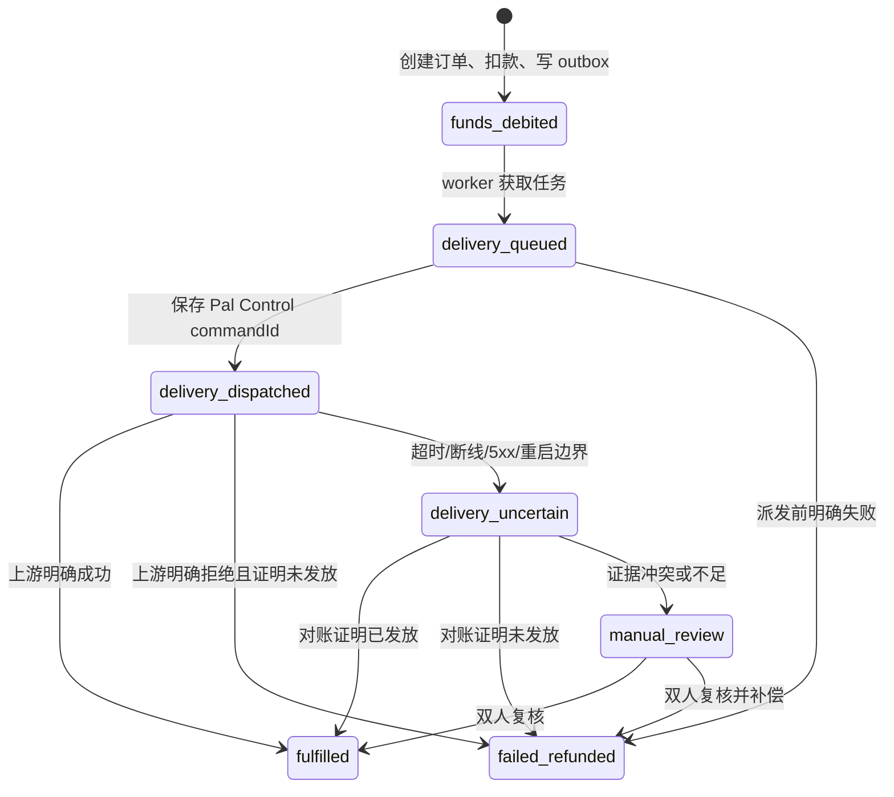
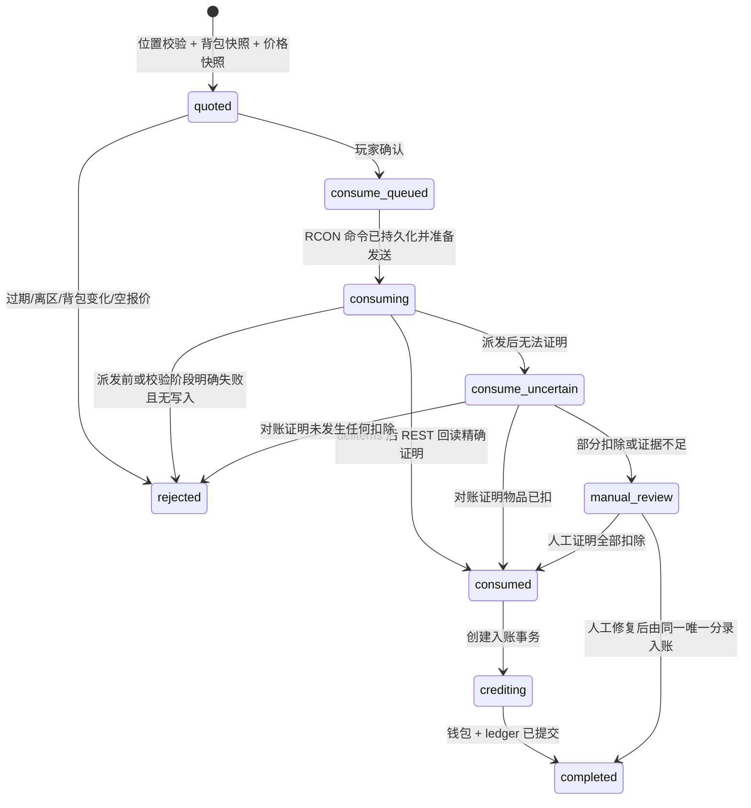

# 03：交易与资源兑换状态机

Palworld 与 PostgreSQL 之间不存在分布式事务。因此本系统使用“数据库事务 + Outbox + 受控游戏命令 + 事后对账”的 Saga，而不是宣称跨系统原子提交。PalDefender REST 发货支持由 Pal Control 包装的幂等键；RCON 扣物本身不支持幂等，两条通道必须区别处理。

## 1. 共同原则

1. 在触碰游戏前，先把领域记录、幂等键和下一步工作持久化。
2. 每个游戏副作用只有一条本地持久记录。上游支持幂等时固定一个确定性键；RCON 不支持时，一旦开始写入就永不自动再发。
3. `accepted` 只代表 Control API 已持久接收，`dispatched` 代表副作用可能已经发生。
4. 派发前明确失败可以安全补偿；派发后 `uncertain` 不能自动重发。
5. 只读查询和数据库内幂等步骤可以重试。
6. 所有状态更新采用 compare-and-set，worker 只能从预期前态推进。
7. 钱包入账和账本分录在一个数据库事务内完成。

## 2. 商城订单

### 2.1 状态图

### 2.2 创建订单的数据库事务

收到 `POST /orders` 后：

1. 验证当前赛季和购买闸门为开放。
2. 使用认证账户查找本周绑定；从 PalDefender 验证玩家在线且 `UserId`、`PlayerUID` 与绑定一致。
3. 锁定所有 offer 和对应限购计数，检查发布时间、币种、数量和剩余额度。
4. 规范化请求并计算 `request_hash`。
5. 如果已存在同幂等键：hash 相同返回旧订单，hash 不同返回 409。
6. `SELECT ... FOR UPDATE` 锁定钱包，验证余额。
7. 插入 `orders(state=funds_debited)` 和不可变 `order_lines`。
8. 钱包减款、version +1，插入 `wallet_ledger(entry_type=shop_debit)`。
9. 原子增加限购占用量。
10. 插入 `outbox(topic=shop.delivery.requested)`。
11. 提交并返回 202。

第 7–10 步必须在同一数据库事务中。接口进程在返回前崩溃时，客户端使用同一幂等键即可读到旧订单，不会二次扣款。

### 2.3 发货 worker

1. 通过租约读取 outbox，CAS 把订单推进到 `delivery_queued`。
2. 再次检查：赛季世界身份、版本组合、玩家绑定和在线状态。玩家临时离线时不派发，按有限退避等待；超过 10 分钟仍未派发则明确取消并退款。
3. 合并相同 ItemID 数量，构造 PalDefender `give/items` payload。
4. 先创建 delivery，固定键为 `shop:<orderId>:delivery:1`。
5. 调用 Pal Control；收到 commandId 后立刻保存，再进入 `delivery_dispatched`。
6. 查询命令直至终态，最长 30 秒；客户端请求不持有此连接。
7. `succeeded` 且 `Granted.Items` 数量一致：订单 `fulfilled`。
8. 明确 4xx 拒绝且命令为 `failed`：执行退款事务。
9. 连接中断、超时、5xx、命令丢失或 `uncertain`：订单 `delivery_uncertain`，既不退款也不再次发货。

发货前背包快照用于人工辅助。明确成功后的背包差值不是硬判据，因为玩家可能立即使用、移动或丢弃物品。

### 2.4 退款事务

退款只能从 `delivery_queued` 的派发前失败，或经过证据证明未发放的 `delivery_dispatched/delivery_uncertain` 进入：

1. 锁定 order 与 wallet；
2. 检查不存在该 order 的 `shop_reversal`；
3. 钱包增加原扣款，写反向 ledger；
4. 释放限购占用；
5. CAS 订单为 `failed_refunded`；
6. 写审计和通知 outbox；
7. 提交。

绝不删除原 `shop_debit`。

### 2.5 发货对账

自动对账只能读取：

- 原 Pal Control commandId 的终态和事件日志；
- PalDefender 日志中包含相同命令时间、UserId 和 payload 的证据；
- 发货前后背包快照；
- 玩家当前背包与在线会话。

判定：

| 证据 | 结果 |
| --- | --- |
| 原 command 最终明确 `succeeded` 且 Granted 数量一致 | `fulfilled` |
| 原 command 明确 `failed`，且失败发生在上游执行前 | `failed_refunded` |
| 原 command 仍 `uncertain`，但快照完整证明请求物品增加且无并发混淆 | 可人工确认 `fulfilled` |
| 背包没有物品，但玩家可能已使用或丢弃 | 不能证明未发放，保持 `manual_review` |
| 管理员想再次给物品 | 创建“补偿发货”新领域记录与新键，不能重写旧 delivery |

## 3. 资源兑换结算

### 3.1 状态图

### 3.2 生成报价

1. 检查版本、世界、赛季、资源兑换和购买闸门。
2. 按 account 加 PostgreSQL advisory lock，避免同时购买/资源兑换导致快照竞争。
3. 验证平台身份与当前在线 PalDefender 玩家完全匹配。
4. 读取位置 A；等待至少 2 秒；读取位置 B。两次均须在同一区域，世界与会话不得变化。
5. 读取 PalDefender 六类背包并规范化：容器和槽位排序、仅保留稳定字段后计算 SHA-256。
6. 只选择 `Items/Food/DropSlot` 和目录中 `sellable=true` 的物品。
7. 从当前价格规则生成 extraction lines；单价、数量、版本均冻结。
8. 保存原始 snapshot、quote、到期时间和审计。
9. 释放 advisory lock。

报价不改变游戏或钱包，可以安全地用相同幂等键重读。新报价会把同一玩家尚未确认的旧报价标为 `rejected/superseded`。

### 3.3 确认与扣物

确认时再次获取同一 account advisory lock，并执行：

1. 验证 quote 所有者、状态和 30 秒有效期。
2. 再读玩家身份与位置，必须仍在线且在原区域。
3. 再读背包；规范哈希必须等于 quote 的 `snapshot_hash`。
4. 从 quote lines 按 ItemID 聚合数量，不接受客户端明细；只允许已验证不会跨排除容器误删的 ItemID。
5. 在数据库事务中 CAS 为 `consume_queued`，插入 inventory consumption 和 outbox。
6. worker 以本地固定键 `extraction:<extractionId>:consume:1` 调用 Control API 的受限 RCON 适配器；该键不能让 RCON 自身幂等。
7. 适配器通过 REST 再读一次 before snapshot，hash 不一致则在发送前明确拒绝。
8. 适配器持久化 `dispatched` 后，只构造并发送一条 `/delitems <UserId> ItemId:Amount...`。`/clearinv` 不允许进入此流程。
9. 无论 RCON 文本返回什么，都通过 PalDefender REST 做有界后读；每个目标 ItemID 在完整六类背包中的总量必须精确减少报价数量，且没有移入排除容器。
10. 只有 REST 差值全部匹配时进入 `consumed`。部分匹配、超额减少、后读失败或写入后连接中断均进入 `consume_uncertain`。

### 3.4 先扣物、后入账

从 `consumed` 入账是纯数据库幂等事务：

1. 锁定 extraction 和 `supply_ticket` wallet；
2. 检查状态至少为 `consumed`；
3. 检查不存在 `(wallet, extraction_credit, extractionId)`；
4. 增加 `quoted_amount`、version +1；
5. 插入唯一 ledger 分录；
6. 更新 extraction 为 `completed`；
7. 插入通知 outbox；
8. 提交。

因此进程在扣物后、入账前崩溃不会丢钱：恢复 worker 会重复执行数据库步骤，唯一约束保证只入账一次。

### 3.5 扣物结果不确定

`consume_uncertain` 时：

- 不增加货币；
- 不使用新幂等键再次扣物；
- 暂停该玩家新的资源兑换和商城购买，避免背包继续变化破坏证据；
- 保存当前 Pal Control 事件、RCON 脱敏文本、连接阶段、PalDefender 日志和 REST 前后快照；
- 只读对账原 command。

对账判定：

| REST 后快照与 quote 对比 | 处理 |
| --- | --- |
| 所有目标 ItemID 总量均精确减少报价数量，排除容器未接收目标物 | `consumed`，随后幂等入账 |
| 所有目标总量完全未变，且连接证据明确写入 0 字节 | `rejected`，解锁玩家 |
| 只有部分 ItemID 或部分数量减少 | `manual_review`；不自动按比例入账 |
| 物品在容器间移动、超额减少或后快照不可得 | `manual_review` |

发生部分扣除时，运营人员需要根据完整证据选择：补齐剩余扣除后按原报价入账，或把已扣物品补发并取消。两种动作都创建独立补偿记录和审计，不能直接改状态掩盖事实。

## 4. 并发控制

### 4.1 锁顺序

统一锁顺序避免死锁：

1. account advisory lock；
2. season/player binding；
3. order 或 extraction；
4. offer/限购；
5. wallet；
6. outbox。

同一账户同时只能有一个游戏背包写操作。RCON consume worker 使用小型有界队列，首版建议全局串行，避免文本响应和 REST 后读交错；未来 Native 后端通过游戏 Tick 有界队列执行。

### 4.2 请求哈希

JSON 规范化后计算 SHA-256：属性按 UTF-8 字典序、整数不带多余格式、数组顺序按业务语义保留。哈希应覆盖 API 版本、账户、当前赛季和 body，避免跨赛季复用同一 key。

### 4.3 限购

限购计数与订单扣款同事务更新。只有 `failed_refunded` 才释放占用；`delivery_uncertain` 暂不释放，防止通过制造超时绕过限购。

## 5. 故障注入矩阵

| 故障点 | 期望恢复 |
| --- | --- |
| 创建订单事务提交前崩溃 | 无订单、无扣款、无 outbox |
| 订单事务提交后、HTTP 返回前崩溃 | 同幂等键返回旧订单 |
| 发货调用前崩溃 | outbox 重做，仍使用同一上游键 |
| 上游执行后、保存 commandId 前崩溃 | 依靠确定性键查询旧命令；不可生成新键 |
| 发货响应丢失 | `delivery_uncertain`，不退款、不重发 |
| 资源兑换报价后玩家移动物品 | commit 以 412 拒绝，无扣物、无入账 |
| RCON 连接前或写入 0 字节时失败 | 明确失败，可取消；不扣物、不入账 |
| RCON 已开始写入后连接断开 | `consume_uncertain`，REST 回读，不入账、不重扣 |
| `/delitems` 只删除部分条目 | `manual_review`，不按比例自动入账 |
| RCON 文本称成功但 REST 数量未精确减少 | `consume_uncertain`，文本不作为成功 ACK |
| 扣物成功后 API 崩溃 | 恢复至 consumed，再唯一入账一次 |
| 钱包事务提交后通知失败 | 只重试通知 outbox，不再入账 |
| 数据库不可用 | 关闭购买与资源兑换；游戏继续运行但不执行经济写入 |

## 6. 熔断条件

任一条件成立，购买或资源兑换闸门自动关闭：

- 数据库不可写或迁移版本不匹配；
- 当前官方 REST `worldguid` 与开放赛季不同；
- PalDefender REST/RCON 断开或版本不是已验收版本；
- RCON 默认未启用、不能证明只由本机连接、防火墙允许远程入站、存在公网映射或密码 Secret 不可用；
- RCON consume 白名单/命令构造探针失败；未来切换 Native 后端时，其 Bridge、capability 或 MOD 版本漂移；
- uncertain 队列超过阈值（建议 5 条或持续 5 分钟）；
- Outbox 最老未处理消息超过 60 秒；
- 周换档处于 `preparing/closing`；
- 管理员手动关闭。

购买只依赖 PalDefender REST，可与依赖 RCON 的资源兑换使用独立闸门；但世界身份或数据库异常必须同时关闭两者。
