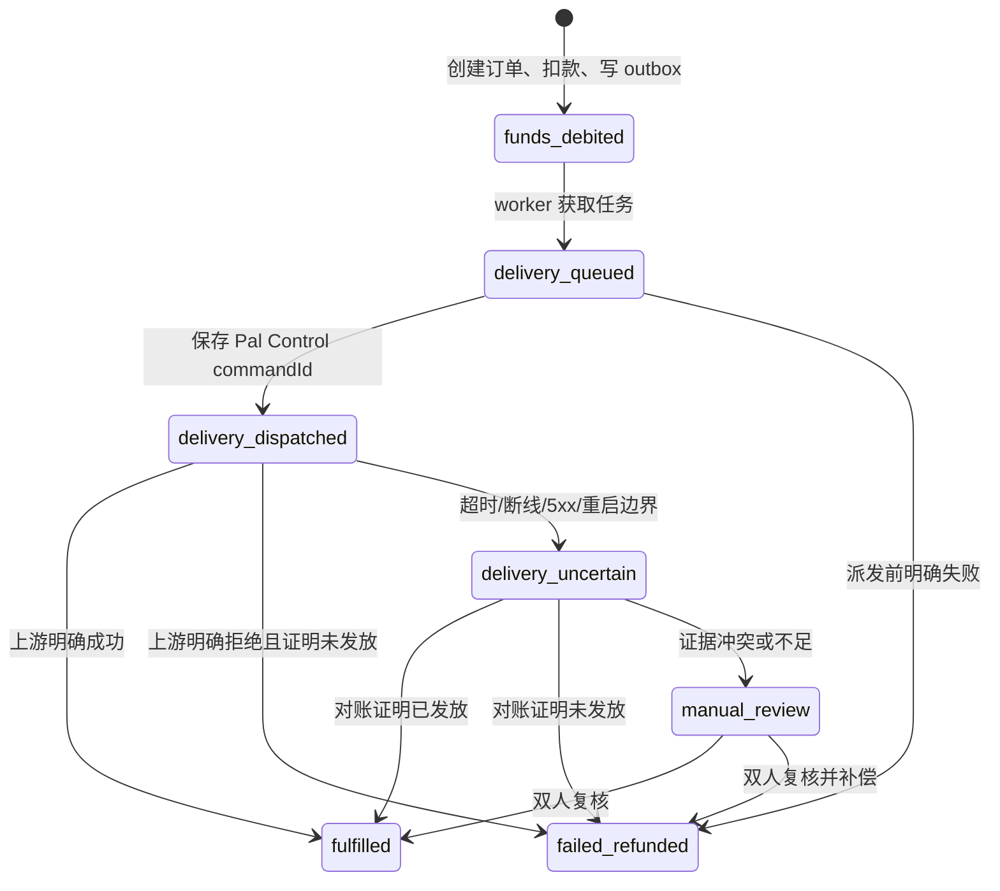
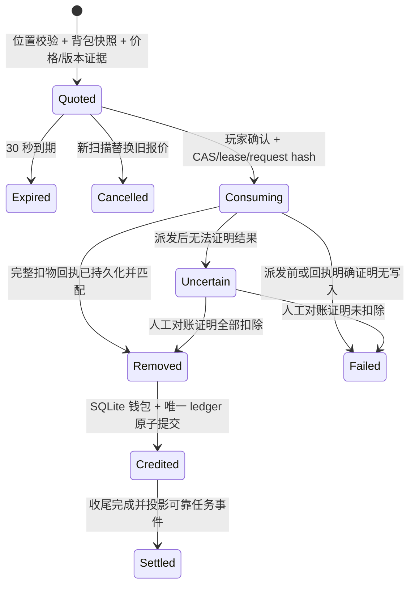

# 03：交易与资源兑换状态机

Palworld 与当前单机 SQLite 经济事实库之间不存在分布式事务。因此本系统使用“数据库事务 + Outbox + 受控游戏命令 + 事后对账”的 Saga，而不是宣称跨系统原子提交。PalDefender REST 发货由 Pal Control 以稳定 delivery key 包装；资源兑换使用 Native `inventory.consume` 的稳定请求键与完整证据快照。两条通道都必须把游戏已执行但回应不确定与明确失败区别处理。

## 1. 共同原则

1. 在触碰游戏前，先把领域记录、幂等键和下一步工作持久化。
2. 每个游戏副作用只有一条本地持久记录，始终重用确定性请求键与 request hash；已开始执行却无法获得可验证结果时，永不换键自动再发。
3. `accepted` 只代表 Control API 已持久接收，`dispatched` 代表副作用可能已经发生。
4. 派发前明确失败可以安全补偿；派发后 `uncertain` 不能自动重发。
5. 只读查询和数据库内幂等步骤可以重试。
6. 所有状态更新采用 compare-and-set，worker 只能从预期前态推进。
7. 钱包入账和账本分录在一个数据库事务内完成。

## 2. 商城订单

### 2.1 状态图

### 2.2 创建订单的数据库事务

收到 `POST /orders` 后：

1. 验证当前赛季和购买闸门为开放，并用请求中的 `contentVersionId + contentHash + SKU` 解析 current offer；版本或 hash 已过期时返回 `OFFER_NOT_AVAILABLE`，不按新价静默替换。
2. 使用认证账户查找本周绑定；从 PalDefender 验证玩家在线且 `UserId`、`PlayerUID` 与绑定一致。
3. 锁定商品、个人限购和可选全服库存，检查发布时间、币种、数量、个人剩余额度和服务器剩余库存；未配置全服库存时不创建虚假上限。
4. 规范化请求并计算 `request_hash`。
5. 如果已存在同幂等键：hash 相同返回旧订单，hash 不同返回 409。
6. `SELECT ... FOR UPDATE` 锁定钱包，验证余额。
7. 插入 `orders(state=funds_debited)` 和不可变 `order_lines`；行内冻结 SKU、分类/标签/推荐位、发放物、单价、限购/库存、content version 与 hash。
8. 钱包减款、version +1，插入 `wallet_ledger(entry_type=shop_debit)`。
9. 原子增加个人限购与可选全服库存占用量。
10. 在同一 `extraction_events` 提交中保存 pending delivery 投影和确定性 delivery key。
11. 提交并返回当前订单投影；玩家端实际路由返回 `200`，发货仍在后台继续。

第 7–10 步必须在同一数据库事务中。接口进程在返回前崩溃时，客户端使用同一幂等键即可读到旧订单，不会二次扣款。这里提交的是待发货领域工作，不代表 PalDefender command 已经 accepted。

### 2.3 发货 worker

1. 从 SQLite 领域投影读取 pending delivery，CAS 把订单推进到 `delivery_queued`。
2. 再次检查：赛季世界身份、版本组合、玩家绑定和在线状态。玩家临时离线时不派发，按有限退避等待；超过 10 分钟仍未派发则明确取消并退款。
3. 合并相同 ItemID 数量，构造 PalDefender `give/items` payload。
4. 先注册不可变 delivery receipt request，固定发货键派生自 `shop:<orderId>:delivery:1`；每个 ItemID 使用稳定子键。
5. 在同一个 `extraction-commerce.db` 的独立事务中写入 PalDefender `accepted` command 和不可变事件；随后保存 commandId 并进入 `delivery_dispatched`。若进程在两步之间崩溃，恢复 worker 以同 key 找回原 command，不会再创建命令。
6. 查询命令直至终态，最长 30 秒；客户端请求不持有此连接。
7. `succeeded` 且 `Granted.Items` 数量一致：订单 `fulfilled`；随后以 `shop-order-delivered:<orderId>` 权威事件推进适用的成功订单/货币消费任务，事件与奖励跨重启唯一。
8. 明确 4xx 拒绝且命令为 `failed`：执行退款事务。
9. 连接中断、超时、5xx、命令丢失或 `uncertain`：订单 `delivery_uncertain`，既不退款也不再次发货。
10. 派发前连续内部失败达到上限：command 进入 dead-letter、购买熔断关闭。全部行都未 `dispatched` 时结构化 receipt 可证明明确失败并退款；若其他行已成功/不确定，则按 partial/uncertain 人工对账，不能把整单当作未发放。

发货前背包快照用于人工辅助。明确成功后的背包差值不是硬判据，因为玩家可能立即使用、移动或丢弃物品。

### 2.4 退款事务

退款只能从 `delivery_queued` 的派发前失败，或经过证据证明未发放的 `delivery_dispatched/delivery_uncertain` 进入：

1. 锁定 order 与 wallet；
2. 检查不存在该 order 的 `shop_reversal`；
3. 钱包增加原扣款，写反向 ledger；
4. 释放个人限购占用及该商品配置的全服库存占用；
5. CAS 订单为 `failed_refunded`；
6. 写审计和通知 outbox；
7. 提交。

绝不删除原 `shop_debit`。

### 2.5 发货对账

自动对账只能读取：

- 原 Pal Control commandId 的终态和事件日志；
- PalDefender 日志中包含相同命令时间、UserId 和 payload 的证据；
- 发货前后背包快照；
- 玩家当前背包与在线会话。

判定：

| 证据 | 结果 |
| --- | --- |
| 原 command 最终明确 `succeeded` 且 Granted 数量一致 | `fulfilled` |
| 原 command 明确 `failed`，且失败发生在上游执行前 | `failed_refunded` |
| 原 command 仍 `uncertain`，但快照完整证明请求物品增加且无并发混淆 | 可人工确认 `fulfilled` |
| 背包没有物品，但玩家可能已使用或丢弃 | 不能证明未发放，保持 `manual_review` |
| 管理员想再次给物品 | 创建“补偿发货”新领域记录与新键，不能重写旧 delivery |

## 3. 资源兑换结算

### 3.1 状态图

图中名称就是当前 `ExtractionSettlementState` 枚举。证据不足不会伪装成独立的 `manual_review` 状态，而是保持 `Uncertain`，只能通过受审计的人工对账转为 `Removed` 或 `Failed`。

### 3.2 生成报价

1. 检查 current content、世界、赛季和资源兑换闸门；至少一个内容定义区域必须在当前服务端时间开放。开放窗口按 `[opensAt, closesAt)` 接收新报价；全关时以 `EXTRACTION_ZONE_CLOSED` 和可计算的 `nextOpensAt` 拒绝。
2. 在单实例服务内按 account 取得有界互斥锁，并用 SQLite 状态/CAS 约束作为持久化安全网，避免同时购买/资源兑换导致快照竞争。
3. 验证平台身份与当前在线 PalDefender 玩家完全匹配。
4. 读取位置 A；等待至少 2 秒；读取位置 B。两次均须在同一区域，世界与会话不得变化。
5. 通过 Native `inventory.probe` 读取 `Items/Food/DropSlot` 的完整槽位与动态元数据，规范排序后计算 SHA-256；显式 Development/RCON 兼容路径也必须对本次报价的全部白名单行做规范哈希，不得复用静态 LootCatalog 摘要冒充背包快照。
6. 只选择 current content 中显式允许、存在于授权目录且关联本兑换区的资源；目录外物品不报价。
7. 从 current content 的资源单价和本区域收益/热点倍率生成 extraction lines；ItemID、单价、数量、区域、倍率和版本证据均冻结。
8. 保存原始 snapshot、quote、到期时间和审计。
9. 释放 advisory lock。

报价不改变游戏或钱包，但报价接口本身不接收 `Idempotency-Key`。重复扫描会创建新 run，并把同一玩家尚未确认的旧 `Quoted` 报价标为 `Cancelled/QUOTE_REPLACED`。

### 3.3 确认与扣物

确认时再次获取同一 account advisory lock，并执行：

1. 验证 quote 所有者、状态和 30 秒有效期。
2. 比较 quote 冻结的 `contentVersionId + contentHash` 与 current pointer；任何一项变化都在写入 `Consuming`、持久化结算键或派发 Native 之前以 `QUOTE_CONTENT_CHANGED` 拒绝，run 保持原始 `Quoted`，背包、钱包和账本均不变。
3. 再读玩家身份与位置，必须仍在线且在原区域；区域在报价后关闭时，只允许在报价自身有效期与内容定义 `graceSeconds` 的交集内完成。closing instant 可用于有正 grace 的旧报价，但不再生成新报价；grace 最后一刻之后拒绝。
4. 再读背包；规范哈希必须等于 quote 的 `snapshot_hash`。
5. 从 quote lines 按 ItemID 聚合数量，不接受客户端明细；只允许已验证不会跨排除容器误删的 ItemID。
6. `StartConsumptionAsync` 以 CAS 把 run 改为 `Consuming`，持久化完整快照、聚合数量、request hash、玩家提交的 `Idempotency-Key` 与处理 lease。
7. 当前 HTTP 结算临界区把同一个玩家 `Idempotency-Key` 原样传给 Native-only adapter；request hash 由 `runId + serverId + payload` 推导。恢复 worker 只接管已有状态/回执，不生成新 key，也不盲目重发。生产配置禁止降级为 RCON。
8. Control API 要求 Native hello 声明已批准的稳定 `inventory.consume` 能力、正确游戏/Steam build/MOD/协议/宿主 EXE 身份和 persistence 证据；当前 dev39-ro 为 runtime validation pending 的 quarantined 只读源码/制品候选，已 superseded 的 dev38-ro、已淘汰的 dev37-ro 或仅有旧 `inventory.consume.experimental` 时，都在发送前关闭闸门。
9. Native 在同一游戏 Tick 内先验证玩家/会话/revision 与每个槽位的容器、索引、ItemID、数量和完整元数据；任一动态、腐坏中、快照不完整或不匹配槽位使整单在写前拒绝。
10. 预检全部通过后执行槽位扣除，包括安全清空普通静态资源槽位；任一写入或回读失败都尝试按原快照回滚并返回不确定/失败证据。
11. 只有返回的 `actualConsumed` 精确等于 requested，完整 before/after 槽位快照与聚合差值都匹配，且回执持久化后，才进入 `Removed`。部分匹配、回读缺失、回滚不可证明或连接中断均保持 `Uncertain` 等待人工对账。

### 3.4 先扣物、后入账

从 `Removed` 入账是纯数据库幂等事务：

1. 锁定 extraction 和 `supply_ticket` wallet；
2. 检查状态为 `Removed`；
3. 检查不存在 `(wallet, extraction_credit, extractionId)`；
4. 增加 `quoted_amount`、version +1；
5. 插入唯一 ledger 分录；
6. 同一事务更新 run 为 `Credited`，随后幂等收尾为 `Settled`；
7. 插入通知 outbox；
8. 提交。

因此进程在扣物后、入账前崩溃不会丢钱：恢复 worker 会重复执行数据库步骤，唯一约束保证只入账一次。

资源兑换持久化为 `Settled` 后，系统以 `resource-settlement:<runId>` 权威事件推进适用的兑换次数、指定 ItemID 和价值任务；相同 run 重放只校验事件 hash，不重复推进或发奖。

### 3.5 扣物结果不确定

`Uncertain` 时：

- 不增加货币；
- 不使用新幂等键再次扣物；
- 暂停该玩家新的资源兑换和商城购买，避免背包继续变化破坏证据；
- 保存当前 Pal Control 事件、Native 请求/结果 hash、连接阶段、脱敏完整槽位前后快照与持久化证据；
- 只读对账原 command。

对账判定：

| REST 后快照与 quote 对比 | 处理 |
| --- | --- |
| 所有目标 ItemID 总量均精确减少报价数量，排除容器未接收目标物 | 双人复核后受审计地转为 `Removed`，随后幂等入账 |
| 所有目标总量完全未变，且传输证据明确证明没有执行写入 | 双人复核后转为 `Failed`，解锁玩家 |
| 只有部分 ItemID 或部分数量减少 | 保持 `Uncertain`；不自动按比例入账 |
| 物品在容器间移动、超额减少或后快照不可得 | 保持 `Uncertain` |

发生部分扣除时，运营人员需要根据完整证据选择：补齐剩余扣除后按原报价入账，或把已扣物品补发并取消。两种动作都创建独立补偿记录和审计，不能直接改状态掩盖事实。

## 4. 并发控制

### 4.1 锁顺序

统一锁顺序避免死锁：

1. account advisory lock；
2. season/player binding；
3. order 或 extraction；
4. offer/限购；
5. wallet；
6. outbox。

同一账户同时只能有一个游戏背包写操作。Native consume 通过游戏 Tick 有界队列执行，Control API 另以持久化状态和稳定键防止跨重启重复副作用。队列满或超时时返回可观测的 backpressure/不确定结果，不绕过队列直接写游戏内存。

### 4.2 请求哈希

JSON 规范化后计算 SHA-256：属性按 UTF-8 字典序、整数不带多余格式、数组顺序按业务语义保留。哈希应覆盖 API 版本、账户、当前赛季和 body，避免跨赛季复用同一 key。

### 4.3 限购

个人限购、可选全服库存与订单扣款同事务更新。只有 `failed_refunded` 才释放占用；`delivery_uncertain` 暂不释放，防止通过制造超时绕过个人或服务器库存。

## 5. 故障注入矩阵

| 故障点 | 期望恢复 |
| --- | --- |
| 创建订单事务提交前崩溃 | 无订单、无扣款、无 outbox |
| 订单事务提交后、HTTP 返回前崩溃 | 同幂等键返回旧订单 |
| 发货调用前崩溃 | outbox 重做，仍使用同一上游键 |
| 上游执行后、保存 commandId 前崩溃 | 依靠确定性键查询旧命令；不可生成新键 |
| 发货响应丢失 | `delivery_uncertain`，不退款、不重发 |
| 资源兑换报价后玩家移动物品 | HTTP 409 `EXTRACTION_INVENTORY_CHANGED`，无扣物、无入账 |
| 报价后内容版本或 hash 切换 | HTTP 409 `QUOTE_CONTENT_CHANGED`，无扣物、无入账 |
| Native 入队前校验失败 | 明确失败，可取消；不扣物、不入账 |
| Native 已受理后连接断开 | `Uncertain`，只查询原键/原结果，不入账、不换键重扣 |
| `actualConsumed` 只匹配部分数量或回滚不可证明 | 保持 `Uncertain`，不按比例自动入账 |
| Native 称成功但完整槽位回读/聚合差值不匹配 | `Uncertain`，单一状态字段不作为成功 ACK |
| 扣物成功后 API 崩溃 | 从持久化回执恢复至 `Removed`，再唯一入账一次 |
| 钱包事务提交后通知失败 | 只重试通知 outbox，不再入账 |
| 数据库不可用 | 关闭购买与资源兑换；游戏继续运行但不执行经济写入 |

## 6. 熔断条件

任一条件成立，购买或资源兑换闸门自动关闭：

- 数据库不可写或迁移版本不匹配；
- 当前官方 REST `worldguid` 与开放赛季不同；
- PalDefender REST 断开或版本不是已验收版本；
- Native Bridge 断开，游戏/MOD/协议版本漂移，完整快照探针失败，或没有经真实重启验收的稳定 `inventory.consume` 与 persistence 证据；
- uncertain 队列超过阈值（建议 5 条或持续 5 分钟）；
- Outbox 最老未处理消息超过 60 秒；
- 周换档处于 `preparing/closing`；
- 管理员手动关闭。

购买依赖 PalDefender REST 发货，资源兑换依赖 Native 稳定消费能力，两者使用独立闸门；但世界身份、数据库、身份映射或账本守恒异常必须同时关闭两者。
